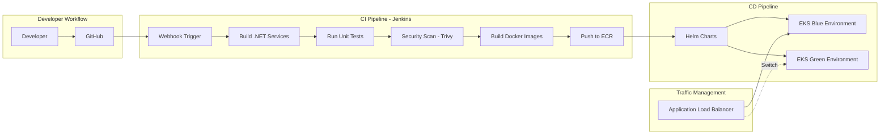
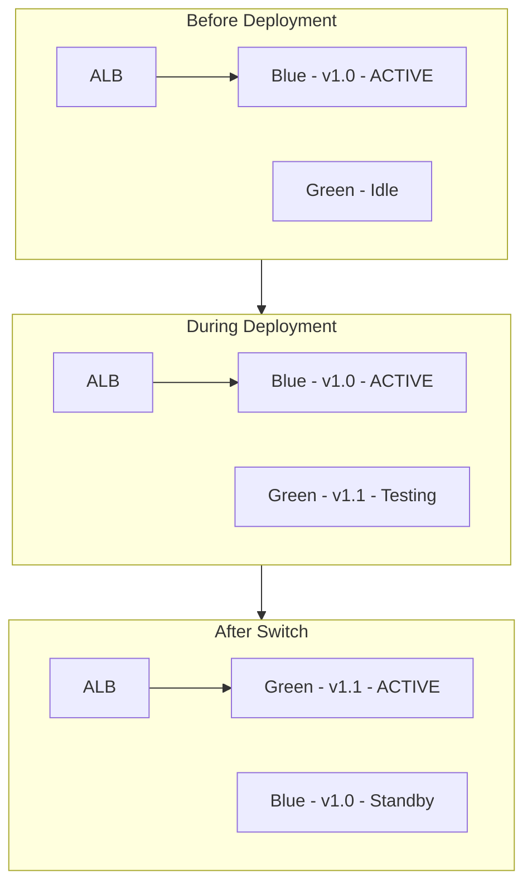
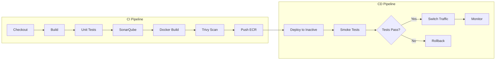

# AmCart CI/CD Pipeline Plan

## Architecture Overview



---

## Technology Stack (All Free)

| Category | Tool | Purpose ||----------|------|---------|| Source Control | GitHub | Code repository || CI/CD Orchestration | Jenkins | Pipeline automation || Container Registry | Amazon ECR | Docker image storage || Container Orchestration | AWS EKS | Kubernetes cluster || Package Manager | Helm | K8s deployments || Security Scanning | Trivy | Container vulnerability scanning || Code Quality | SonarQube | Static code analysis || Secrets | AWS Secrets Manager | Secure credentials || Monitoring | Prometheus + Grafana | Pipeline & app monitoring |---

## 1. Jenkins Setup on AWS

### 1.1 Infrastructure

- Deploy Jenkins on EC2 (t3.medium) or EKS as a pod
- Use EBS for persistent storage
- Configure IAM roles for ECR and EKS access

### 1.2 Required Jenkins Plugins (Free)

- Pipeline
- Git
- Docker Pipeline
- Amazon ECR
- Kubernetes CLI
- Blue Ocean (UI)
- SonarQube Scanner

---

## 2. Repository Structure

```javascript
AmCart/
├── src/
│   └── Services/
│       ├── UserService/
│       │   ├── Dockerfile
│       │   └── ...
│       ├── ProductService/
│       ├── OrderService/
│       └── ... (9 microservices)
├── helm/
│   ├── Chart.yaml
│   ├── values.yaml
│   ├── values-dev.yaml
│   ├── values-staging.yaml
│   ├── values-prod.yaml
│   └── templates/
│       ├── deployment.yaml
│       ├── service.yaml
│       ├── ingress.yaml
│       └── configmap.yaml
├── jenkins/
│   ├── Jenkinsfile
│   └── scripts/
│       ├── build.sh
│       ├── test.sh
│       └── deploy.sh
├── terraform/
│   ├── eks/
│   ├── ecr/
│   └── jenkins/
└── docker-compose.yml
```

---

## 3. CI Pipeline (Build & Test)

### Jenkinsfile - CI Stage

```groovy
pipeline {
    agent any
    
    environment {
        AWS_REGION = 'us-east-1'
        ECR_REGISTRY = 'xxxx.dkr.ecr.us-east-1.amazonaws.com'
        IMAGE_TAG = "${BUILD_NUMBER}"
    }
    
    stages {
        stage('Checkout') {
            steps {
                checkout scm
            }
        }
        
        stage('Build & Test') {
            parallel {
                stage('UserService') {
                    steps {
                        dir('src/Services/UserService') {
                            sh 'dotnet restore'
                            sh 'dotnet build --no-restore'
                            sh 'dotnet test --no-build'
                        }
                    }
                }
                stage('ProductService') {
                    steps {
                        dir('src/Services/ProductService') {
                            sh 'dotnet restore'
                            sh 'dotnet build --no-restore'
                            sh 'dotnet test --no-build'
                        }
                    }
                }
                // ... other services in parallel
            }
        }
        
        stage('Code Quality - SonarQube') {
            steps {
                withSonarQubeEnv('SonarQube') {
                    sh 'dotnet sonarscanner begin /k:"AmCart"'
                    sh 'dotnet build'
                    sh 'dotnet sonarscanner end'
                }
            }
        }
        
        stage('Build Docker Images') {
            steps {
                script {
                    def services = ['UserService', 'ProductService', 'OrderService', 
                                    'CartService', 'PaymentService', 'InventoryService',
                                    'SearchService', 'NotificationService', 'ReviewService']
                    
                    for (service in services) {
                        docker.build("${ECR_REGISTRY}/amcart-${service.toLowerCase()}:${IMAGE_TAG}", 
                                    "./src/Services/${service}")
                    }
                }
            }
        }
        
        stage('Security Scan - Trivy') {
            steps {
                script {
                    sh "trivy image --exit-code 1 --severity HIGH,CRITICAL ${ECR_REGISTRY}/amcart-userservice:${IMAGE_TAG}"
                }
            }
        }
        
        stage('Push to ECR') {
            steps {
                script {
                    sh "aws ecr get-login-password --region ${AWS_REGION} | docker login --username AWS --password-stdin ${ECR_REGISTRY}"
                    
                    def services = ['userservice', 'productservice', 'orderservice', 
                                    'cartservice', 'paymentservice', 'inventoryservice',
                                    'searchservice', 'notificationservice', 'reviewservice']
                    
                    for (service in services) {
                        sh "docker push ${ECR_REGISTRY}/amcart-${service}:${IMAGE_TAG}"
                    }
                }
            }
        }
    }
}
```

---

## 4. CD Pipeline (Blue/Green Deployment)

### Blue/Green Strategy




### Jenkinsfile - CD Stage

```groovy
stage('Deploy to EKS - Blue/Green') {
    steps {
        script {
            // Determine which environment is inactive
            def activeEnv = sh(script: "kubectl get svc amcart-frontend -o jsonpath='{.spec.selector.version}'", returnStdout: true).trim()
            def targetEnv = (activeEnv == 'blue') ? 'green' : 'blue'
            
            // Deploy to inactive environment
            sh """
                helm upgrade --install amcart-${targetEnv} ./helm \\
                    --namespace amcart \\
                    --set image.tag=${IMAGE_TAG} \\
                    --set environment=${targetEnv} \\
                    -f ./helm/values-prod.yaml
            """
            
            // Wait for deployment
            sh "kubectl rollout status deployment/amcart-userservice-${targetEnv} -n amcart --timeout=300s"
            
            // Run smoke tests
            sh "./jenkins/scripts/smoke-test.sh ${targetEnv}"
            
            // Switch traffic
            sh """
                kubectl patch svc amcart-frontend -n amcart \\
                    -p '{"spec":{"selector":{"version":"${targetEnv}"}}}'
            """
            
            echo "Traffic switched to ${targetEnv} environment"
        }
    }
}
```

---

## 5. Helm Chart Structure

### values.yaml

```yaml
replicaCount: 2

image:
  repository: xxxx.dkr.ecr.us-east-1.amazonaws.com/amcart
  tag: latest
  pullPolicy: Always

services:
    - name: userservice
    port: 5001
    - name: productservice
    port: 5002
    - name: orderservice
    port: 5004
  # ... other services

ingress:
  enabled: true
  className: nginx
  hosts:
        - host: api.amcart.com
      paths:
                - path: /api/v1/users
          service: userservice
                - path: /api/v1/products
          service: productservice

resources:
  limits:
    cpu: 500m
    memory: 512Mi
  requests:
    cpu: 250m
    memory: 256Mi
```

---

## 6. Pipeline Stages Summary



---

## 7. Environment Promotion

| Environment | Trigger | Approval ||-------------|---------|----------|| Development | Every push to `develop` | Automatic || Staging | Merge to `staging` | Automatic || Production | Merge to `main` | Manual approval in Jenkins |---

## 8. Rollback Strategy

```groovy
stage('Rollback if needed') {
    when {
        expression { params.ROLLBACK == true }
    }
    steps {
        script {
            def currentEnv = sh(script: "kubectl get svc amcart-frontend -o jsonpath='{.spec.selector.version}'", returnStdout: true).trim()
            def previousEnv = (currentEnv == 'blue') ? 'green' : 'blue'
            
            sh """
                kubectl patch svc amcart-frontend -n amcart \\
                    -p '{"spec":{"selector":{"version":"${previousEnv}"}}}'
            """
            echo "Rolled back to ${previousEnv}"
        }
    }
}
```

---

## 9. Files to Create

| File | Purpose ||------|---------|| `jenkins/Jenkinsfile` | Main CI/CD pipeline || `helm/Chart.yaml` | Helm chart definition || `helm/values.yaml` | Default values || `helm/values-prod.yaml` | Production overrides || `helm/templates/deployment.yaml` | K8s deployment template || `helm/templates/service.yaml` | K8s service template || `terraform/eks/main.tf` | EKS cluster IaC || `terraform/jenkins/main.tf` | Jenkins EC2 IaC || `docs/CI-CD-Guide.md` | Documentation |---

## 10. Cost Estimate (Free Tier + Minimal)

| Component | Cost ||-----------|------|| Jenkins (t3.medium EC2) | ~$30/month || EKS Control Plane | $73/month || ECR (first 500MB free) | ~$0 || Worker Nodes (3x t3.medium) | ~$100/month || SonarQube (self-hosted) | Free || Trivy | Free || GitHub | Free || **Total** | **~$200/month** |---

## Implementation Order

1. Set up Jenkins on EC2 with required plugins
2. Configure Jenkins credentials (AWS, GitHub)
3. Create ECR repositories for all services
4. Set up Helm charts for deployments
5. Create Jenkinsfile with CI stages