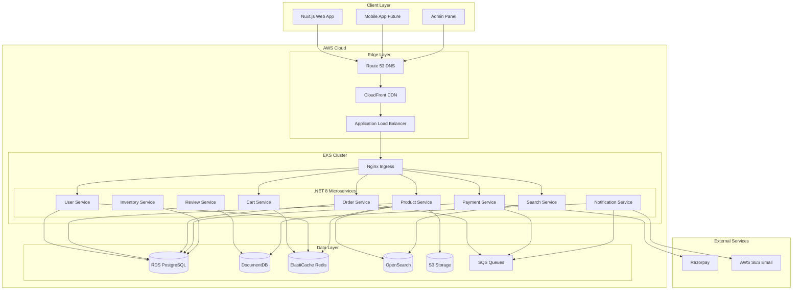
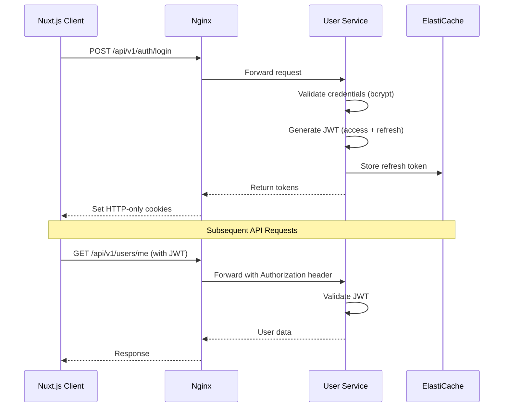

# AmCart Ecommerce Platform - Complete System Design

## Architecture Overview

AmCart is built using a **microservices architecture** with the following key components:

- **Frontend**: Nuxt.js 3 (Vue.js) - Server-side rendered web application
- **Reverse Proxy**: Nginx - Request routing, load balancing, SSL termination
- **Backend**: .NET 8 (ASP.NET Core) microservices - Business logic
- **Databases**: PostgreSQL, MongoDB, Redis, Elasticsearch - Polyglot persistence
- **Message Broker**: RabbitMQ / Amazon SQS - Async communication
- **Cloud**: AWS (EKS, RDS, ElastiCache, S3, CloudFront)
- **Deployment**: Docker + Kubernetes (EKS)

---

## Technology Stack

### Frontend Layer

| Technology | Version | Purpose ||------------|---------|---------|| Nuxt.js | 3.x | SSR/SSG Frontend Framework || Vue.js | 3.x | UI Framework || Tailwind CSS | 3.x | Styling || Nuxt UI | Latest | Component Library || Pinia | 2.x | State Management || TypeScript | 5.x | Type Safety |

### Reverse Proxy Layer

| Technology | Version | Purpose ||------------|---------|---------|| Nginx | 1.25.x | Reverse Proxy, Load Balancer || Let's Encrypt / ACM | - | SSL Certificates |

### Backend Layer (Microservices)

| Technology | Version | Purpose ||------------|---------|---------|| .NET | 8.0 LTS | Application Framework || C# | 12.0 | Programming Language || ASP.NET Core | 8.0 | Web API Framework || Entity Framework Core | 8.0 | ORM (PostgreSQL) || MediatR | 12.x | CQRS Pattern || FluentValidation | 11.x | Request Validation || Polly | 8.x | Resilience & Retry || MassTransit | 8.x | Message Broker Abstraction || Serilog | 3.x | Structured Logging || AutoMapper | 12.x | Object Mapping |

### Data Layer

| Database | AWS Service | Purpose ||----------|-------------|---------|| PostgreSQL | Amazon RDS | Transactional Data (Users, Orders, Products) || MongoDB | Amazon DocumentDB | Document Data (Reviews, Notifications, Logs) || Redis | Amazon ElastiCache | Cache, Sessions, Cart, Queues || Elasticsearch | Amazon OpenSearch | Product Search, Analytics |

### AWS Infrastructure

| Service | Purpose ||---------|---------|| EKS | Kubernetes orchestration || ECR | Container registry || RDS | PostgreSQL database || DocumentDB | MongoDB-compatible database || ElastiCache | Redis caching || OpenSearch | Search engine || S3 | Object storage (images) || CloudFront | CDN || Route 53 | DNS management || ALB | Application Load Balancer || ACM | SSL certificates || CloudWatch | Monitoring & logging || Secrets Manager | Secret storage || SQS/SNS | Message queuing |---

## System Architecture Diagram



---

## Microservices Definition

### Service Registry

| Service | Port | Database | Responsibilities ||---------|------|----------|------------------|| **UserService** | 5001 | PostgreSQL, Redis | User registration, authentication, profiles, addresses || **ProductService** | 5002 | PostgreSQL, OpenSearch, Redis | Product catalog, categories, brands, images || **CartService** | 5003 | Redis, PostgreSQL | Shopping cart CRUD, coupon validation || **OrderService** | 5004 | PostgreSQL | Order creation, status tracking, history || **PaymentService** | 5005 | PostgreSQL | Razorpay integration, payment processing || **InventoryService** | 5006 | PostgreSQL, Redis | Stock management, availability checks || **SearchService** | 5007 | OpenSearch | Full-text search, autocomplete, filters || **NotificationService** | 5008 | DocumentDB, Redis | Email, SMS, push notifications || **ReviewService** | 5009 | DocumentDB | Product reviews, ratings, comments |---

## Database Schema Design

### PostgreSQL Schema (Relational Data)

```mermaid
erDiagram
    users ||--o{ orders : places
    users ||--o{ addresses : has
    users ||--o{ cart_items : has
    users ||--o{ wishlist_items : saves
    
    products ||--o{ product_variants : has
    products ||--o{ product_images : has
    products ||--o{ cart_items : in
    products ||--o{ order_items : in
    products }o--|| categories : belongs_to
    products }o--|| brands : belongs_to
    
    orders ||--o{ order_items : contains
    orders ||--|| payments : has
    orders }o--|| addresses : ships_to
    
    categories ||--o{ categories : has_children
    
    inventory ||--|| product_variants : tracks

    users {
        uuid id PK
        string email UK
        string password_hash
        string name
        string phone
        enum gender
        string avatar_url
        enum role
        boolean is_verified
        boolean is_active
        timestamp created_at
        timestamp updated_at
    }

    products {
        uuid id PK
        string sku UK
        string name
        string slug UK
        text description
        decimal base_price
        decimal sale_price
        boolean is_on_sale
        boolean is_new
        boolean is_featured
        boolean is_active
        uuid category_id FK
        uuid brand_id FK
        jsonb attributes
        timestamp created_at
    }

    product_variants {
        uuid id PK
        uuid product_id FK
        string color
        string size
        string sku UK
        decimal price_modifier
        int stock_quantity
        boolean is_active
    }

    orders {
        uuid id PK
        string order_number UK
        uuid user_id FK
        uuid shipping_address_id FK
        uuid billing_address_id FK
        enum status
        decimal subtotal
        decimal discount_amount
        string coupon_code
        decimal shipping_cost
        decimal tax_amount
        decimal total
        text notes
        timestamp placed_at
        timestamp shipped_at
        timestamp delivered_at
    }

    payments {
        uuid id PK
        uuid order_id FK UK
        string razorpay_order_id UK
        string razorpay_payment_id
        string razorpay_signature
        enum method
        enum status
        decimal amount
        string currency
        jsonb metadata
        timestamp created_at
    }

    inventory {
        uuid id PK
        uuid variant_id FK UK
        int quantity
        int reserved_quantity
        int reorder_level
        timestamp last_restocked
    }
```


### MongoDB Collections (DocumentDB)

#### Reviews Collection

```javascript
{
  _id: ObjectId,
  productId: "uuid",
  userId: "uuid",
  userName: "John Doe",
  userAvatar: "url",
  rating: 4.5,
  title: "Great product!",
  content: "Detailed review text...",
  images: ["url1", "url2"],
  isVerifiedPurchase: true,
  helpful: { up: 15, down: 2 },
  status: "approved",
  replies: [{
    userId: "uuid",
    content: "Thank you!",
    createdAt: ISODate
  }],
  createdAt: ISODate,
  updatedAt: ISODate
}
```


#### Notifications Collection

```javascript
{
  _id: ObjectId,
  userId: "uuid",
  type: "order_shipped",
  channel: "email",
  template: "order-shipped",
  data: {
    orderId: "ORD-123",
    trackingNumber: "TRK-456",
    carrier: "FedEx"
  },
  status: "sent",
  sentAt: ISODate,
  readAt: ISODate,
  createdAt: ISODate
}
```


### Redis Data Structures (ElastiCache)

| Key Pattern | Type | TTL | Purpose ||-------------|------|-----|---------|| `session:{sessionId}` | Hash | 24h | User session data || `cart:{userId}` | Hash | 7d | Shopping cart items || `product:{id}` | String | 1h | Product cache || `category:tree` | String | 6h | Category hierarchy || `inventory:{variantId}` | String | 5m | Real-time stock || `rate:{ip}:{endpoint}` | String | 1m | Rate limiting || `otp:{phone}` | String | 5m | OTP verification |---

## API Design

### Nginx Routes Configuration

```nginx
# /etc/nginx/conf.d/api.conf

upstream user_service {
    least_conn;
    server user-service.amcart.svc.cluster.local:5001;
    keepalive 32;
}

upstream product_service {
    least_conn;
    server product-service.amcart.svc.cluster.local:5002;
    keepalive 32;
}

upstream cart_service {
    least_conn;
    server cart-service.amcart.svc.cluster.local:5003;
    keepalive 32;
}

upstream order_service {
    least_conn;
    server order-service.amcart.svc.cluster.local:5004;
    keepalive 32;
}

upstream payment_service {
    least_conn;
    server payment-service.amcart.svc.cluster.local:5005;
    keepalive 32;
}

upstream search_service {
    least_conn;
    server search-service.amcart.svc.cluster.local:5007;
    keepalive 32;
}

# Rate limiting zones
limit_req_zone $binary_remote_addr zone=api_limit:10m rate=100r/s;
limit_req_zone $binary_remote_addr zone=auth_limit:10m rate=10r/s;

server {
    listen 80;
    server_name api.amcart.com;

    # Auth endpoints
    location /api/v1/auth/ {
        limit_req zone=auth_limit burst=20 nodelay;
        proxy_pass http://user_service;
        include /etc/nginx/proxy_params;
    }

    # User endpoints
    location /api/v1/users/ {
        limit_req zone=api_limit burst=50 nodelay;
        proxy_pass http://user_service;
        include /etc/nginx/proxy_params;
    }

    # Product endpoints
    location /api/v1/products/ {
        limit_req zone=api_limit burst=100 nodelay;
        proxy_pass http://product_service;
        include /etc/nginx/proxy_params;
    }

    # Cart endpoints
    location /api/v1/cart/ {
        limit_req zone=api_limit burst=50 nodelay;
        proxy_pass http://cart_service;
        include /etc/nginx/proxy_params;
    }

    # Order endpoints
    location /api/v1/orders/ {
        limit_req zone=api_limit burst=30 nodelay;
        proxy_pass http://order_service;
        include /etc/nginx/proxy_params;
    }

    # Payment endpoints
    location /api/v1/payments/ {
        limit_req zone=api_limit burst=20 nodelay;
        proxy_pass http://payment_service;
        include /etc/nginx/proxy_params;
    }

    # Search endpoints
    location /api/v1/search/ {
        limit_req zone=api_limit burst=100 nodelay;
        proxy_pass http://search_service;
        include /etc/nginx/proxy_params;
    }

    # Health check
    location /health {
        return 200 'OK';
        add_header Content-Type text/plain;
    }
}
```


### API Endpoints by Service

#### User Service (5001)

| Method | Endpoint | Description ||--------|----------|-------------|| POST | `/api/v1/auth/register` | User registration || POST | `/api/v1/auth/login` | Email/password login || POST | `/api/v1/auth/oauth/{provider}` | Social login callback || POST | `/api/v1/auth/refresh` | Refresh JWT token || POST | `/api/v1/auth/forgot-password` | Request password reset || POST | `/api/v1/auth/reset-password` | Reset password with token || GET | `/api/v1/users/me` | Get current user profile || PUT | `/api/v1/users/me` | Update profile || GET | `/api/v1/users/me/addresses` | List addresses || POST | `/api/v1/users/me/addresses` | Add address || PUT | `/api/v1/users/me/addresses/{id}` | Update address || DELETE | `/api/v1/users/me/addresses/{id}` | Delete address |

#### Product Service (5002)

| Method | Endpoint | Description ||--------|----------|-------------|| GET | `/api/v1/products` | List products with filters || GET | `/api/v1/products/{slug}` | Get product by slug || GET | `/api/v1/products/new` | New arrivals || GET | `/api/v1/products/featured` | Featured products || GET | `/api/v1/products/sale` | Products on sale || GET | `/api/v1/categories` | Get category tree || GET | `/api/v1/categories/{slug}/products` | Products by category || GET | `/api/v1/brands` | List all brands || POST | `/api/v1/admin/products` | Create product (Admin) || PUT | `/api/v1/admin/products/{id}` | Update product (Admin) || DELETE | `/api/v1/admin/products/{id}` | Delete product (Admin) |

#### Cart Service (5003)

| Method | Endpoint | Description ||--------|----------|-------------|| GET | `/api/v1/cart` | Get current cart || POST | `/api/v1/cart/items` | Add item to cart || PUT | `/api/v1/cart/items/{id}` | Update item quantity || DELETE | `/api/v1/cart/items/{id}` | Remove item from cart || DELETE | `/api/v1/cart` | Clear cart || POST | `/api/v1/cart/coupon` | Apply coupon code || DELETE | `/api/v1/cart/coupon` | Remove coupon |

#### Order Service (5004)

| Method | Endpoint | Description ||--------|----------|-------------|| POST | `/api/v1/orders` | Create order from cart || GET | `/api/v1/orders` | List user orders || GET | `/api/v1/orders/{id}` | Get order details || POST | `/api/v1/orders/{id}/cancel` | Cancel order || GET | `/api/v1/admin/orders` | List all orders (Admin) || PUT | `/api/v1/admin/orders/{id}/status` | Update order status (Admin) |

#### Payment Service (5005)

| Method | Endpoint | Description ||--------|----------|-------------|| POST | `/api/v1/payments/create-order` | Create Razorpay order || POST | `/api/v1/payments/verify` | Verify payment signature || POST | `/api/v1/payments/webhook` | Razorpay webhook handler || GET | `/api/v1/payments/{orderId}` | Get payment details || POST | `/api/v1/admin/payments/{id}/refund` | Initiate refund (Admin) |

#### Search Service (5007)

| Method | Endpoint | Description ||--------|----------|-------------|| GET | `/api/v1/search` | Full-text product search || GET | `/api/v1/search/autocomplete` | Search suggestions || GET | `/api/v1/search/filters` | Available filter options |---

## .NET 8 Project Structure

```javascript
AmCart/
├── src/
│   ├── Services/
│   │   ├── UserService/
│   │   │   ├── UserService.Api/
│   │   │   │   ├── Controllers/
│   │   │   │   │   ├── AuthController.cs
│   │   │   │   │   ├── UsersController.cs
│   │   │   │   │   └── AddressesController.cs
│   │   │   │   ├── Middleware/
│   │   │   │   ├── Extensions/
│   │   │   │   ├── Program.cs
│   │   │   │   ├── appsettings.json
│   │   │   │   ├── Dockerfile
│   │   │   │   └── UserService.Api.csproj
│   │   │   ├── UserService.Application/
│   │   │   │   ├── Commands/
│   │   │   │   ├── Queries/
│   │   │   │   ├── Handlers/
│   │   │   │   ├── DTOs/
│   │   │   │   ├── Validators/
│   │   │   │   └── Mappings/
│   │   │   ├── UserService.Domain/
│   │   │   │   ├── Entities/
│   │   │   │   ├── Interfaces/
│   │   │   │   ├── Enums/
│   │   │   │   └── Events/
│   │   │   └── UserService.Infrastructure/
│   │   │       ├── Data/
│   │   │       ├── Repositories/
│   │   │       └── Services/
│   │   │
│   │   ├── ProductService/
│   │   │   └── ... (same Clean Architecture structure)
│   │   ├── CartService/
│   │   ├── OrderService/
│   │   ├── PaymentService/
│   │   ├── InventoryService/
│   │   ├── SearchService/
│   │   ├── NotificationService/
│   │   └── ReviewService/
│   │
│   ├── BuildingBlocks/
│   │   ├── Common/
│   │   │   ├── Common.Logging/
│   │   │   ├── Common.Messaging/
│   │   │   ├── Common.Security/
│   │   │   └── Common.Exceptions/
│   │   └── EventBus/
│   │       ├── EventBus.Messages/
│   │       └── EventBus.MassTransit/
│   │
│   └── Gateway/
│       └── nginx/
│           ├── nginx.conf
│           ├── conf.d/
│           └── Dockerfile
│
├── tests/
│   ├── UserService.UnitTests/
│   ├── UserService.IntegrationTests/
│   └── ... (per service)
│
├── deploy/
│   ├── docker/
│   │   ├── docker-compose.yml
│   │   └── docker-compose.override.yml
│   ├── k8s/
│   │   ├── base/
│   │   │   ├── namespace.yaml
│   │   │   ├── nginx/
│   │   │   ├── user-service/
│   │   │   ├── product-service/
│   │   │   └── ...
│   │   ├── overlays/
│   │   │   ├── dev/
│   │   │   ├── staging/
│   │   │   └── prod/
│   │   └── kustomization.yaml
│   └── terraform/
│       ├── main.tf
│       ├── vpc.tf
│       ├── eks.tf
│       ├── rds.tf
│       ├── elasticache.tf
│       ├── opensearch.tf
│       ├── s3.tf
│       ├── outputs.tf
│       └── variables.tf
│
├── AmCart.sln
└── README.md
```

---

## Frontend Structure (Nuxt.js 3)

### Pages Structure

```javascript
pages/
├── index.vue                     # Home page
├── login.vue                     # Login
├── register.vue                  # Registration
├── forgot-password.vue           # Password reset
├── products/
│   ├── index.vue                 # Product listing
│   └── [slug].vue                # Product detail
├── category/
│   └── [...slug].vue             # Category pages (nested)
├── search.vue                    # Search results
├── sale.vue                      # Sale products
├── new-arrivals.vue              # New products
├── cart.vue                      # Shopping cart
├── checkout/
│   ├── index.vue                 # Checkout start
│   ├── shipping.vue              # Shipping info
│   ├── payment.vue               # Payment
│   └── complete.vue              # Order confirmation
├── account/
│   ├── index.vue                 # Dashboard
│   ├── profile.vue               # Profile settings
│   ├── orders/
│   │   ├── index.vue             # Order history
│   │   └── [id].vue              # Order detail
│   ├── addresses.vue             # Address book
│   └── wishlist.vue              # Wishlist
├── admin/
│   ├── index.vue                 # Admin dashboard
│   ├── products/
│   │   ├── index.vue             # Product list
│   │   ├── create.vue            # Add product
│   │   └── [id]/
│   │       └── edit.vue          # Edit product
│   ├── orders/
│   │   ├── index.vue             # Order management
│   │   └── [id].vue              # Order detail
│   ├── customers.vue             # Customer list
│   └── inventory.vue             # Stock management
├── contact.vue                   # Contact us
├── about.vue                     # About us
└── [...slug].vue                 # CMS pages / 404
```


### Composables

| Composable | Purpose ||------------|---------|| `useAuth()` | Authentication state, login, logout, register || `useUser()` | User profile, addresses || `useProducts()` | Product fetching, filters || `useCart()` | Cart operations || `useCheckout()` | Checkout flow || `usePayment()` | Razorpay integration || `useOrders()` | Order history || `useWishlist()` | Wishlist operations || `useSearch()` | Search functionality || `useReviews()` | Product reviews |

### Pinia Stores

| Store | State ||-------|-------|| `useUserStore` | user, isAuthenticated, token || `useCartStore` | items, total, coupon || `useWishlistStore` | items || `useUIStore` | cartDrawerOpen, searchOpen, mobileMenuOpen |---

## Event-Driven Communication

### Message Queues (SQS/RabbitMQ)

| Queue | Publisher | Subscribers | Purpose ||-------|-----------|-------------|---------|| `order-created` | Order Service | Inventory, Notification | Order lifecycle || `payment-completed` | Payment Service | Order, Notification | Payment confirmation || `payment-failed` | Payment Service | Order, Notification | Payment failure || `inventory-reserved` | Inventory Service | Order | Stock reservation || `inventory-released` | Inventory Service | - | Stock release || `user-registered` | User Service | Notification | Welcome email || `product-updated` | Product Service | Search Service | ES sync |

### MassTransit Configuration

```csharp
// Program.cs
builder.Services.AddMassTransit(x =>
{
    x.AddConsumer<OrderCreatedConsumer>();
    x.AddConsumer<PaymentCompletedConsumer>();
    
    x.UsingRabbitMq((context, cfg) =>
    {
        cfg.Host(builder.Configuration["RabbitMQ:Host"], "/", h =>
        {
            h.Username(builder.Configuration["RabbitMQ:Username"]);
            h.Password(builder.Configuration["RabbitMQ:Password"]);
        });

        cfg.ConfigureEndpoints(context);
    });
    
    // Or use Amazon SQS
    // x.UsingAmazonSqs((context, cfg) =>
    // {
    //     cfg.Host("us-east-1", h =>
    //     {
    //         h.AccessKey("...");
    //         h.SecretKey("...");
    //     });
    //     cfg.ConfigureEndpoints(context);
    // });
});
```

---

## Security Architecture

### Authentication Flow




### Security Measures

| Layer | Measure | Implementation ||-------|---------|----------------|| Transport | HTTPS | ACM certificates, ALB SSL termination || Gateway | Rate Limiting | Nginx limit_req || Gateway | IP Whitelisting | Nginx geo module (admin) || Auth | JWT | RS256 signed, short expiry || Auth | Refresh Tokens | HTTP-only cookies, Redis storage || API | Input Validation | FluentValidation || API | CORS | Nginx headers || Data | Encryption at Rest | RDS encryption, S3 SSE || Data | PII Protection | Encryption, masking || Secrets | Management | AWS Secrets Manager || Audit | Logging | CloudWatch, Serilog |---

## AWS Deployment Architecture

### Terraform Infrastructure

```hcl
# main.tf
provider "aws" {
  region = var.aws_region
}

# VPC
module "vpc" {
  source = "terraform-aws-modules/vpc/aws"
  
  name = "amcart-vpc"
  cidr = "10.0.0.0/16"
  
  azs             = ["us-east-1a", "us-east-1b", "us-east-1c"]
  private_subnets = ["10.0.1.0/24", "10.0.2.0/24", "10.0.3.0/24"]
  public_subnets  = ["10.0.101.0/24", "10.0.102.0/24", "10.0.103.0/24"]
  
  enable_nat_gateway = true
  single_nat_gateway = false
  
  tags = {
    Environment = var.environment
    Project     = "amcart"
  }
}

# EKS Cluster
module "eks" {
  source          = "terraform-aws-modules/eks/aws"
  
  cluster_name    = "amcart-eks"
  cluster_version = "1.28"
  
  vpc_id          = module.vpc.vpc_id
  subnet_ids      = module.vpc.private_subnets
  
  eks_managed_node_groups = {
    main = {
      desired_size = 3
      min_size     = 2
      max_size     = 5
      
      instance_types = ["t3.medium"]
    }
  }
}

# RDS PostgreSQL
resource "aws_db_instance" "postgres" {
  identifier           = "amcart-postgres"
  engine               = "postgres"
  engine_version       = "15"
  instance_class       = "db.t3.medium"
  allocated_storage    = 100
  
  db_name              = "amcart"
  username             = var.db_username
  password             = var.db_password
  
  multi_az             = true
  storage_encrypted    = true
  
  vpc_security_group_ids = [aws_security_group.rds.id]
  db_subnet_group_name   = aws_db_subnet_group.main.name
}

# ElastiCache Redis
resource "aws_elasticache_cluster" "redis" {
  cluster_id           = "amcart-redis"
  engine               = "redis"
  node_type            = "cache.t3.micro"
  num_cache_nodes      = 2
  
  subnet_group_name    = aws_elasticache_subnet_group.main.name
  security_group_ids   = [aws_security_group.redis.id]
}

# OpenSearch
resource "aws_opensearch_domain" "search" {
  domain_name    = "amcart-search"
  engine_version = "OpenSearch_2.11"
  
  cluster_config {
    instance_type  = "t3.small.search"
    instance_count = 2
  }
  
  ebs_options {
    ebs_enabled = true
    volume_size = 50
  }
}

# S3 Bucket
resource "aws_s3_bucket" "media" {
  bucket = "amcart-media-${var.environment}"
}

# CloudFront Distribution
resource "aws_cloudfront_distribution" "cdn" {
  origin {
    domain_name = aws_s3_bucket.media.bucket_regional_domain_name
    origin_id   = "S3-amcart-media"
    
    s3_origin_config {
      origin_access_identity = aws_cloudfront_origin_access_identity.main.cloudfront_access_identity_path
    }
  }
  
  enabled         = true
  is_ipv6_enabled = true
  
  default_cache_behavior {
    allowed_methods        = ["GET", "HEAD"]
    cached_methods         = ["GET", "HEAD"]
    target_origin_id       = "S3-amcart-media"
    viewer_protocol_policy = "redirect-to-https"
    
    forwarded_values {
      query_string = false
      cookies {
        forward = "none"
      }
    }
  }
  
  restrictions {
    geo_restriction {
      restriction_type = "none"
    }
  }
  
  viewer_certificate {
    acm_certificate_arn = var.acm_certificate_arn
    ssl_support_method  = "sni-only"
  }
}
```


### Kubernetes Deployment

```yaml
# k8s/base/user-service/deployment.yaml
apiVersion: apps/v1
kind: Deployment
metadata:
  name: user-service
  namespace: amcart
spec:
  replicas: 3
  selector:
    matchLabels:
      app: user-service
  template:
    metadata:
      labels:
        app: user-service
    spec:
      containers:
            - name: user-service
        image: ${AWS_ACCOUNT_ID}.dkr.ecr.${AWS_REGION}.amazonaws.com/amcart/user-service:latest
        ports:
                - containerPort: 5001
        resources:
          requests:
            memory: "256Mi"
            cpu: "250m"
          limits:
            memory: "512Mi"
            cpu: "500m"
        env:
                - name: ASPNETCORE_ENVIRONMENT
          value: "Production"
                - name: ConnectionStrings__DefaultConnection
          valueFrom:
            secretKeyRef:
              name: amcart-secrets
              key: postgres-connection
                - name: Redis__ConnectionString
          valueFrom:
            secretKeyRef:
              name: amcart-secrets
              key: redis-connection
        livenessProbe:
          httpGet:
            path: /health
            port: 5001
          initialDelaySeconds: 30
          periodSeconds: 10
        readinessProbe:
          httpGet:
            path: /health/ready
            port: 5001
          initialDelaySeconds: 5
          periodSeconds: 5
---
apiVersion: v1
kind: Service
metadata:
  name: user-service
  namespace: amcart
spec:
  selector:
    app: user-service
  ports:
    - port: 5001
    targetPort: 5001
  type: ClusterIP
---
apiVersion: autoscaling/v2
kind: HorizontalPodAutoscaler
metadata:
  name: user-service-hpa
  namespace: amcart
spec:
  scaleTargetRef:
    apiVersion: apps/v1
    kind: Deployment
    name: user-service
  minReplicas: 2
  maxReplicas: 10
  metrics:
    - type: Resource
    resource:
      name: cpu
      target:
        type: Utilization
        averageUtilization: 70
```

---

## Implementation Phases

### Phase 1: Infrastructure Setup (Week 1-2)

- Set up AWS account, IAM roles, and permissions
- Deploy VPC, subnets, security groups with Terraform
- Set up EKS cluster with worker nodes
- Deploy RDS PostgreSQL, ElastiCache Redis, OpenSearch
- Configure S3 buckets and CloudFront
- Set up CI/CD pipeline (GitHub Actions / AWS CodePipeline)

### Phase 2: Core Services (Week 3-5)

- Build User Service (auth, profiles, addresses)
- Build Product Service (catalog, categories, brands)
- Build Cart Service (Redis-based cart)
- Configure Nginx routing
- Implement JWT authentication
- Set up Nuxt.js frontend with basic pages

### Phase 3: Order & Payment (Week 6-8)

- Build Order Service (order lifecycle)
- Build Payment Service (Razorpay integration)
- Build Inventory Service (stock management)
- Implement checkout flow in frontend
- Event-driven order processing with MassTransit

### Phase 4: Search & Discovery (Week 9-10)

- Build Search Service (OpenSearch)
- Implement autocomplete
- Product sync to OpenSearch
- Frontend search integration
- Filters and faceted search

### Phase 5: Supporting Services (Week 11-12)

- Build Notification Service (AWS SES, SNS)
- Build Review Service (DocumentDB)
- Wishlist functionality
- Admin dashboard

### Phase 6: Production Ready (Week 13-14)

- Kubernetes HPA configuration
- CloudWatch monitoring and alarms
- Distributed tracing (X-Ray)
- Security audit and penetration testing
- Load testing (k6, Artillery)
- Production deployment

---

## Monitoring & Observability

### AWS CloudWatch

| Metric | Service | Alarm Threshold ||--------|---------|-----------------|| CPU Utilization | EKS Nodes | > 80% || Memory Usage | EKS Pods | > 85% || Request Latency | ALB | p99 > 500ms || Error Rate | ALB | 5xx > 1% || DB Connections | RDS | > 80% || Cache Hit Rate | ElastiCache | < 80% |

### Logging

```csharp
// Serilog configuration
Log.Logger = new LoggerConfiguration()
    .MinimumLevel.Information()
    .Enrich.FromLogContext()
    .Enrich.WithProperty("ServiceName", "UserService")
    .WriteTo.Console(new JsonFormatter())
    .WriteTo.CloudWatch(new CloudWatchSinkOptions
    {
        LogGroupName = "/amcart/user-service",
        TextFormatter = new JsonFormatter()
    })
    .CreateLogger();
```


### Distributed Tracing (AWS X-Ray)

```csharp
// Program.cs
builder.Services.AddAWSXRayRecorder();
builder.Services.AddAWSMessageHandlerForHttpClient();

app.UseXRay("UserService");


```