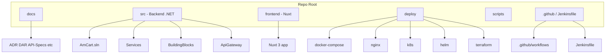

# AmCart Single-Repo Folder Structure and Projects

## Repo root layout

All application code, deployment assets, and CI/CD live in **one GitHub repo**. Root-level layout:




---

## 1. Root-level directories


| Path            | Purpose                                                                                                                    |
| --------------- | -------------------------------------------------------------------------------------------------------------------------- |
| **docs/**       | Existing documentation (ADR, DAR, API-Specifications, Database-Schema-*, Deployment-Guide, Runbooks, diagrams). No change. |
| **src/**        | Backend: .NET 8 solution, all microservices, building blocks, API gateway config.                                          |
| **frontend/**   | Nuxt.js 3 app (Vue 3, Tailwind, Pinia).                                                                                    |
| **deploy/**     | Docker Compose files, Nginx configs, Kubernetes manifests, Helm charts, Terraform.                                         |
| **scripts/**    | Helper scripts (run all services, migrations, local setup).                                                                |
| **.github/**    | GitHub Actions workflows (optional; can trigger Jenkins or run CI/CD).                                                     |
| **Jenkinsfile** | Jenkins pipeline (build, test, scan, Docker build/push, Helm/kubectl deploy). At repo root.                                |


Optional at root: **docker-compose.yml** and **docker-compose.infrastructure.yml** (for local/full stack) or keep them under **deploy/docker/** and reference from there. The [Deployment-Guide](docs/Deployment-Guide.md) uses `./src`, `./frontend`, `./deploy/nginx`; placing compose at root keeps those paths and is a common choice.

---

## 2. Backend: `src/`

### 2.1 Solution and top-level structure

- **AmCart.sln** at `src/AmCart.sln` (or `src/AmCart.sln`; solution file lives inside `src/`).
- **Services/** – One folder per microservice.
- **BuildingBlocks/** – Shared libraries (Common.Logging, Common.Messaging, Common.Security, etc.).
- **ApiGateway/** – Nginx config and optional Dockerfile for Nginx (or only config if image is `nginx:alpine`).

### 2.2 Projects (microservices)

Each service follows Clean Architecture: **Api**, **Application**, **Domain**, **Infrastructure**. One **Dockerfile per service** at `src/Services/<ServiceName>/Dockerfile`; build context is **src/** (so COPY paths are relative to `src/`).


| Service      | Path                                | Projects (folders)                                                                       | Dockerfile                                    |
| ------------ | ----------------------------------- | ---------------------------------------------------------------------------------------- | --------------------------------------------- |
| User         | `src/Services/UserService/`         | UserService.Api, UserService.Application, UserService.Domain, UserService.Infrastructure | `src/Services/UserService/Dockerfile`         |
| Product      | `src/Services/ProductService/`      | ProductService.Api, .Application, .Domain, .Infrastructure                               | `src/Services/ProductService/Dockerfile`      |
| Cart         | `src/Services/CartService/`         | CartService.Api, .Application, .Domain, .Infrastructure                                  | `src/Services/CartService/Dockerfile`         |
| Order        | `src/Services/OrderService/`        | OrderService.Api, .Application, .Domain, .Infrastructure                                 | `src/Services/OrderService/Dockerfile`        |
| Payment      | `src/Services/PaymentService/`      | PaymentService.Api, .Application, .Domain, .Infrastructure                               | `src/Services/PaymentService/Dockerfile`      |
| Search       | `src/Services/SearchService/`       | SearchService.Api, .Application, .Domain, .Infrastructure                                | `src/Services/SearchService/Dockerfile`       |
| Notification | `src/Services/NotificationService/` | NotificationService.Api, .Application, .Domain, .Infrastructure                          | `src/Services/NotificationService/Dockerfile` |
| Review       | `src/Services/ReviewService/`       | ReviewService.Api, .Application, .Domain, .Infrastructure                                | `src/Services/ReviewService/Dockerfile`       |


Inventory is part of ProductService (combined service per [Database-Schema-Product](docs/Database-Schema-Product.md)); no separate InventoryService project.

### 2.3 Per-service folder structure (example: UserService)

```
src/Services/UserService/
├── UserService.Api/
│   ├── Controllers/
│   ├── Program.cs
│   ├── appsettings.json
│   └── UserService.Api.csproj
├── UserService.Application/
│   ├── Commands/
│   ├── Queries/
│   ├── Handlers/
│   ├── DTOs/
│   ├── Validators/
│   └── UserService.Application.csproj
├── UserService.Domain/
│   ├── Entities/
│   ├── Interfaces/
│   └── UserService.Domain.csproj
├── UserService.Infrastructure/
│   ├── Data/
│   │   ├── UserDbContext.cs
│   │   └── Migrations/
│   ├── Repositories/
│   └── UserService.Infrastructure.csproj
└── Dockerfile
```

Dockerfile location: `**src/Services/UserService/Dockerfile**` (not inside Api). Build from repo root:  
`docker build -t amcart/user-service:latest -f src/Services/UserService/Dockerfile src/`

### 2.4 Building blocks

```
src/BuildingBlocks/
├── Common/
│   ├── Common.Logging/
│   ├── Common.Messaging/
│   └── Common.Security/
└── (optional) EventBus/
    ├── EventBus.Messages/
    └── EventBus.RabbitMQ/
```

Each is a .NET project referenced by the relevant service projects.

### 2.5 API Gateway (Nginx)

```
src/ApiGateway/
└── nginx/
    ├── nginx.conf
    ├── conf.d/
    │   └── default.conf
    └── Dockerfile   (optional; or use nginx:alpine + volume mount)
```

Deployment-Guide references **deploy/nginx/** for mounted config; Nginx config can live either under **deploy/nginx/** or **src/ApiGateway/nginx/** with deploy only symlinking or copying. Recommendation: **deploy/nginx/** holds the configs used by Docker/K8s so deploy is self-contained.

---

## 3. Frontend: `frontend/`

- Nuxt 3 app (Vue 3, TypeScript, Tailwind, Pinia).
- **Dockerfile** at `**frontend/Dockerfile**` (build context: `frontend/`).
- Example layout: `app/`, `components/`, `pages/`, `composables/`, `stores/`, `nuxt.config.ts`, `package.json`.

Docker Compose (from [Deployment-Guide](docs/Deployment-Guide.md)):  
`context: ./frontend`, `dockerfile: Dockerfile`.

---

## 4. Deploy: `deploy/`

All deployment-related files live under **deploy/** so infra and app deploy are in one place.


| Path                  | Purpose                                                                                   |
| --------------------- | ----------------------------------------------------------------------------------------- |
| **deploy/docker/**    | docker-compose.yml, docker-compose.infrastructure.yml (or these at repo root; see below). |
| **deploy/nginx/**     | nginx.conf, conf.d/*.conf – used by Compose and K8s.                                      |
| **deploy/k8s/**       | Kubernetes manifests (base/, overlays/dev/, overlays/prod/, kustomization.yaml).          |
| **deploy/helm/**      | Helm charts for AmCart (one chart or chart per service). Optional if using raw k8s only.  |
| **deploy/terraform/** | Terraform for AWS (EKS, RDS, VPC, etc.): main.tf, eks.tf, rds.tf, variables.tf.           |


Docker Compose placement:

- **Option A:** `docker-compose.yml` and `docker-compose.infrastructure.yml` at **repo root** – matches existing Deployment-Guide paths (`./src`, `./frontend`, `./deploy/nginx`).
- **Option B:** Same files under **deploy/docker/** – then run with `docker-compose -f deploy/docker/docker-compose.yml up` and adjust context paths (e.g. `context: ../../src`).

Recommendation: **Option A** (compose at root) for simplicity and alignment with [Deployment-Guide](docs/Deployment-Guide.md).

---

## 5. Dockerfiles – summary


| Component           | Dockerfile path                                                                                                       | Build context |
| ------------------- | --------------------------------------------------------------------------------------------------------------------- | ------------- |
| UserService         | src/Services/UserService/Dockerfile                                                                                   | src/          |
| ProductService      | src/Services/ProductService/Dockerfile                                                                                | src/          |
| CartService         | src/Services/CartService/Dockerfile                                                                                   | src/          |
| OrderService        | src/Services/OrderService/Dockerfile                                                                                  | src/          |
| PaymentService      | src/Services/PaymentService/Dockerfile                                                                                | src/          |
| SearchService       | src/Services/SearchService/Dockerfile                                                                                 | src/          |
| NotificationService | src/Services/NotificationService/Dockerfile                                                                           | src/          |
| ReviewService       | src/Services/ReviewService/Dockerfile                                                                                 | src/          |
| Frontend            | frontend/Dockerfile                                                                                                   | frontend/     |
| Nginx               | Use image `nginx:alpine`; config from deploy/nginx/ (no Dockerfile) or deploy/nginx/Dockerfile if custom image needed |               |


Build commands (from repo root):

```bash
docker build -t amcart/user-service:latest -f src/Services/UserService/Dockerfile src/
docker build -t amcart/frontend:latest -f frontend/Dockerfile frontend/
```

---

## 6. CI/CD files – where they live

### 6.1 Jenkins

- **Jenkinsfile** at **repo root** (`Jenkinsfile`).
- Pipeline: checkout → build .NET (e.g. `dotnet build src/AmCart.sln`) → run tests → security scan (Trivy) → build Docker images (`-f src/Services/<Service>/Dockerfile src/`) → push to ECR → deploy (Helm or kubectl).
- Jenkins webhook triggers on push to main (or branch of choice).

### 6.2 GitHub Actions (optional)

- **.github/workflows/** – e.g. `ci.yml`, `cd.yml` or `deploy.yml`.
- Can run tests and Docker build/push; or only trigger Jenkins; or run full CI/CD instead of Jenkins.
- As per [DAR-Technology-Stack-Selection](docs/DAR-Technology-Stack-Selection.md), primary CI/CD is Jenkins; GitHub Actions can be used for triggers or as an alternative.

### 6.3 Deployment (from CI/CD)

- **Kubernetes:** `kubectl apply -f deploy/k8s/base/` (and overlays if using Kustomize) or `helm upgrade --install amcart deploy/helm/amcart`.
- **Terraform:** `terraform -chdir=deploy/terraform apply` (for infra); typically run separately or from a dedicated job.

---

## 7. Scripts: `scripts/`


| Script                      | Purpose                                                                                   |
| --------------------------- | ----------------------------------------------------------------------------------------- |
| scripts/run-all-services.sh | Start all .NET services locally (from `src/`: run each Service.*.Api).                    |
| scripts/run-migrations.sh   | Run EF Core migrations (e.g. per service or loop).                                        |
| scripts/local-infra.sh      | Start only infra (Postgres, Redis, RabbitMQ, etc.) via docker-compose.infrastructure.yml. |


Scripts run from repo root; they `cd src` or `cd frontend` as needed so paths stay consistent.

---

## 8. Final tree (concise)

```
amcart/
├── .github/
│   └── workflows/
│       ├── ci.yml
│       └── cd.yml
├── Jenkinsfile
├── docker-compose.yml
├── docker-compose.infrastructure.yml
├── docs/
│   ├── ADR/
│   ├── Runbooks/
│   ├── diagrams/
│   └── ...
├── frontend/
│   ├── app/
│   ├── components/
│   ├── nuxt.config.ts
│   ├── package.json
│   └── Dockerfile
├── src/
│   ├── AmCart.sln
│   ├── ApiGateway/
│   │   └── nginx/
│   ├── BuildingBlocks/
│   │   └── Common/
│   └── Services/
│       ├── UserService/
│       │   ├── UserService.Api/
│       │   ├── UserService.Application/
│       │   ├── UserService.Domain/
│       │   ├── UserService.Infrastructure/
│       │   └── Dockerfile
│       ├── ProductService/
│       │   └── ... + Dockerfile
│       ├── CartService/
│       ├── OrderService/
│       ├── PaymentService/
│       ├── SearchService/
│       ├── NotificationService/
│       └── ReviewService/
├── deploy/
│   ├── docker/
│   ├── nginx/
│   │   ├── nginx.conf
│   │   └── conf.d/
│   ├── k8s/
│   │   ├── base/
│   │   └── overlays/
│   ├── helm/
│   └── terraform/
├── scripts/
│   ├── run-all-services.sh
│   ├── run-migrations.sh
│   └── local-infra.sh
├── .gitignore
└── README.md
```

---

## 9. Alignment with existing docs

- [Deployment-Guide](docs/Deployment-Guide.md) – Uses `src/`, `frontend/`, `deploy/nginx`, `Services/<Name>/Dockerfile`, `deploy/k8s`; this structure matches.
- [DAR-Backend-Technology-DotNet](docs/DAR-Backend-Technology-DotNet.md) – Service layout (Api, Application, Domain, Infrastructure) and Dockerfile under each service are aligned.
- [DAR-Technology-Stack-Selection](docs/DAR-Technology-Stack-Selection.md) – Jenkins + Docker + Helm; Jenkinsfile at root, deploy/helm and deploy/k8s cover both Helm and raw K8s.

No edits to existing docs are required; this plan only defines the repo layout and where Docker and CI/CD files live.