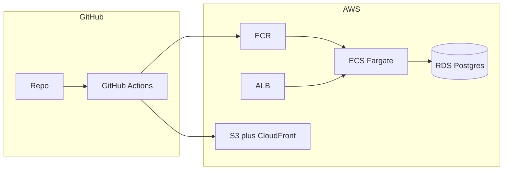

# AWS CI/CD and infrastructure roadmap

## AWS Free Tier account — what this changes

**“Free Tier” usually means:** limited **12-month** benefits for new accounts (e.g. EC2 `t2.micro`/`t3.micro` hours, RDS single-AZ micro, some S3/transfer) **plus** a smaller set of **Always Free** offers. **Always verify** in [AWS Free Tier](https://aws.amazon.com/free/) for your region—offers change.

**Typical bill surprises (not covered like “free EC2”):**

- **Application Load Balancer (ALB)** — hourly + LCU charges; often **tens of USD/month** even idle.
- **NAT Gateway** — hourly + data processing; often **~$30+/month** per NAT.
- **ECS Fargate / EKS** — pay for vCPU/memory; **not** the same as “750 hrs EC2 free.”
- **Elastic IP** attached to stopped EC2 — small but easy to forget.
- **Data transfer** out to internet — can add up.

**Free-tier–friendly learning path (recommended for your account):**

1. **UI**: **S3** static hosting (or S3 + **CloudFront**; check current free data/requests). Build SPA with `VITE_`* pointing at your API URL. Avoid extra ALB just for static files.
2. **API + DB (cheapest pattern)**: One **EC2 Free Tier–eligible** instance (`t3.micro` / `t2.micro` where offered), install **Docker**, run **docker compose** (UserService image + Postgres container **or** connect to **RDS PostgreSQL db.t3.micro** if you use the RDS free tier slot). Expose **only** 80/443 via security group; no NAT required if everything is on that subnet/public host pattern for **dev only**.
3. **Optional**: **ECR** to store images (Free Tier includes limited ECR storage for 12 months—still check); CI pushes to ECR, EC2 pulls—**or** build on the instance for the very first spike to skip ECR.
4. **Secrets**: Prefer **SSM Parameter Store** (standard parameters) for dev over **Secrets Manager** to reduce extra charges while learning.
5. **Billing safety**: Turn on **Billing alerts** (CloudWatch alarm on estimated charges), use **AWS Budgets**, and **destroy** ALB/NAT/idle RDS when experiments end.

**When you outgrow Free Tier (closer to “real” AWS):** move to **ECS Fargate + ALB + RDS in private subnets + NAT** (or **VPC endpoints** to avoid NAT where possible)—same architecture as the original diagram, **expect monthly cost** unless you qualify for specific credits/programs.

---

## Recommended defaults for your stack

| Area              | Recommendation                             | Why                                                                                                                 |
| ----------------- | ------------------------------------------ | ------------------------------------------------------------------------------------------------------------------- |
| **CI/CD**         | **GitHub Actions**                         | Native to GitHub, OIDC auth to AWS (no long-lived keys), YAML in-repo, free minutes for public/small private repos. |
| **Infra as code** | **Terraform** (after a small manual spike) | Reproducible environments, reviewable PRs, same path to staging/prod.                                               |
| **Jenkins**       | Only if required                           | Extra server (EC2/EKS), plugins, secrets, and maintenance; use if org mandates it or you need on-prem agents.       |

**UserService** (`[src/Services/UserService/Dockerfile](src/Services/UserService/Dockerfile)`): **Free Tier dev** → **EC2 + Docker** (compose) or **RDS micro + EC2**; **later** → container in **ECR** + **ECS Fargate** + **ALB**, or **EKS** if you standardize on existing K8s manifests under UserService.

**UI** (`[src/Frontends/ui-app/Dockerfile](src/Frontends/ui-app/Dockerfile)`): two common patterns:

- **S3 + CloudFront** (static `dist/`): cheap, fast global CDN, fits a SPA with `index.html` fallback; API calls go to your gateway/UserService URL via env at build time or runtime config.
- **Container behind ALB**: same pattern as API; more moving parts.

**Database**: **RDS PostgreSQL** (same engine you use locally) in private subnets; credentials in **Secrets Manager** or **SSM Parameter Store**; UserService reads connection string from env/secret at startup (you already use EF migrations on startup in places—confirm they are safe for prod concurrency / run jobs separately if needed).

---

## Phase 0 — Lock assumptions (1–2 hours)

- **Budget mode**: **Strict Free Tier** (EC2 + Docker + S3 UI) vs **small paid lab** (ALB + NAT + ECS)—pick explicitly.
- **Runtime target**: For Free Tier, **EC2 + Docker Compose** first; defer **ECS Fargate + ALB** until you accept ~40–80+/mo typical lab cost.
- **UI delivery**: **S3 (+ CloudFront)** strongly preferred over a second load-balanced service for static assets.
- **Environments**: `dev` only first; second env doubles cost.
- **Domain/TLS**: Optional on Free Tier; **HTTP + EC2 public DNS** is enough for learning; add **Route 53 + ACM** when you want proper HTTPS (often with ALB or CloudFront).
- **Config**: `VITE_`* / API base URLs per environment (build args or runtime `config.json` for SPA).

---

## Phase 1 — Manual AWS “spike” (learn + validate)

Goal: one working **dev** deployment without Terraform so you understand costs and networking.

**Track A — Free Tier–oriented (start here):**

1. **EC2**: Launch **Amazon Linux 2022** or **Ubuntu**, **t3.micro** (or eligible free tier type in your region), key pair, security group **SSH from your IP** + **TCP 5000/5001** (or 80 if you reverse-proxy) for the API.
2. **On the instance**: Install Docker; `docker run` / **docker compose** for **UserService** + env vars; Postgres either as **container** on same host (simplest) or **RDS db.t3.micro** with SG allowing EC2 SG on `5432`.
3. **UI**: S3 bucket (block public access off **only** if using static website hosting pattern correctly—or use **CloudFront OAC**); `aws s3 sync` the Vite `dist/`; set API URL in build to `http://EC2_PUBLIC_IP:port` for a quick test (CORS must allow your S3/CloudFront origin on the API).
4. **Optional ECR**: Push image from laptop for a “real” pull-based deploy drill.

**Track B — “Production-shaped” lab (expect charges):**

1. **Network**: VPC, public subnets (ALB), private subnets (ECS, RDS), **NAT** (costly).
2. **ECR**, **ECS Fargate** + **ALB**, **RDS** as in the original diagram; **Secrets Manager** or SSM for connection strings.
3. **UI**: Still prefer **S3 + CloudFront** over another ALB target.

**Easier for “test things out” on Free Tier**: **Track A** in console first; add **Terraform** once the bill pattern is understood. **Copilot/ECS wizards** align more with **Track B** (cost).

---

## Phase 2 — Terraform for initial setup

- **Start small (Free Tier track)**: `ec2_instance` (+ `user_data` for Docker), `security_group`, optional `db_instance` (micro) or skip RDS module and use compose; `s3_bucket` + `s3_bucket_public_access_block` / CloudFront resources as needed; **GitHub OIDC** + deploy role.
- **Start small (paid lab track)**: `vpc`, `ecr`, `ecs`, `alb`, `rds`, IAM task roles, OIDC for Actions.
- **State**: S3 backend + DynamoDB lock (team-safe); minimal S3/Dynamo cost on Free Tier but not zero—acceptable for learning.
- **Structure**: e.g. `infra/envs/dev/`, modules for `network`, `ecs-service`, `rds`.
- **Import or recreate**: Either `terraform import` resources you created manually, or destroy dev and recreate cleanly (only if data loss OK).

Manual-first vs Terraform-first:

- **Manual first** is often **easier mentally** for AWS newcomers.
- **Terraform first** is **easier long-term** if you already know the services; otherwise you risk rework when the console setup drifts.

**Pragmatic path**: manual dev spike → document every resource → Terraform to match → delete manual drift.

---

## Phase 3 — GitHub Actions CI/CD

Typical workflows (separate or matrix):

1. **On PR**: lint/test (`dotnet test`, `npm test` if any), `docker build` (no push) to verify Dockerfile.
2. **On merge to `main` (or tags)**:
  - **Free Tier track**: build UI → sync to S3; build/push **UserService** to ECR (optional) → **SSM send-command** or **SSH** to EC2 `docker compose pull && up -d` (simplest) or install a tiny **CodeDeploy** / **Watchtower**-style flow later.
  - **ECS track**: push ECR → `aws ecs update-service --force-new-deployment` via OIDC.
  - **UI (S3)**: build with env-specific `VITE_`*, sync, invalidate CloudFront if used.

**Security**: Configure **OIDC** (`aws-actions/configure-aws-credentials` with `role-to-assume`); avoid storing IAM user keys in GitHub Secrets for production.

---

## Phase 4 — Hardening (before “real” prod)

- WAF on ALB/CloudFront (optional dev; often skipped on strict Free Tier).
- RDS backups; **Multi-AZ** for real prod (not Free Tier–friendly—use single-AZ for dev).
- CloudWatch alarms, log retention, X-Ray or OpenTelemetry if needed.
- Secrets rotation; least-privilege IAM for tasks and deploy role.
- Separate AWS accounts per env (Organizations) if the org grows.

---

## Direct answers

1. **Next steps (Free Tier)**: **Track A** — EC2 + Docker (+ Postgres on host or RDS micro) + S3 UI + billing alerts → GitHub Actions (test + deploy) → Terraform when stable. Move to **ECS + ALB** when you accept ongoing cost.
2. **Manual vs Terraform**: **Manual first** on Free Tier to avoid paying for NAT/ALB while learning; **Terraform** once the target shape is fixed.
3. **Jenkins vs other**: **GitHub Actions** remains the better default on GitHub; no extra EC2 to run Jenkins (which would compete with your Free Tier hours).

---

## Optional repo layout (later)

- `.github/workflows/user-service.yml`, `.github/workflows/ui-app.yml` (or one workflow with `paths` filters).
- `infra/terraform/` at repo root or under `[src/Infrastructure](src/Infrastructure)` (you already have nginx there—keep Terraform sibling or under `infra/` for clarity).

No code changes are required in this plan phase; this is an execution roadmap for your team.