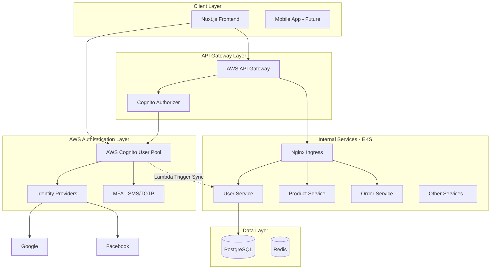
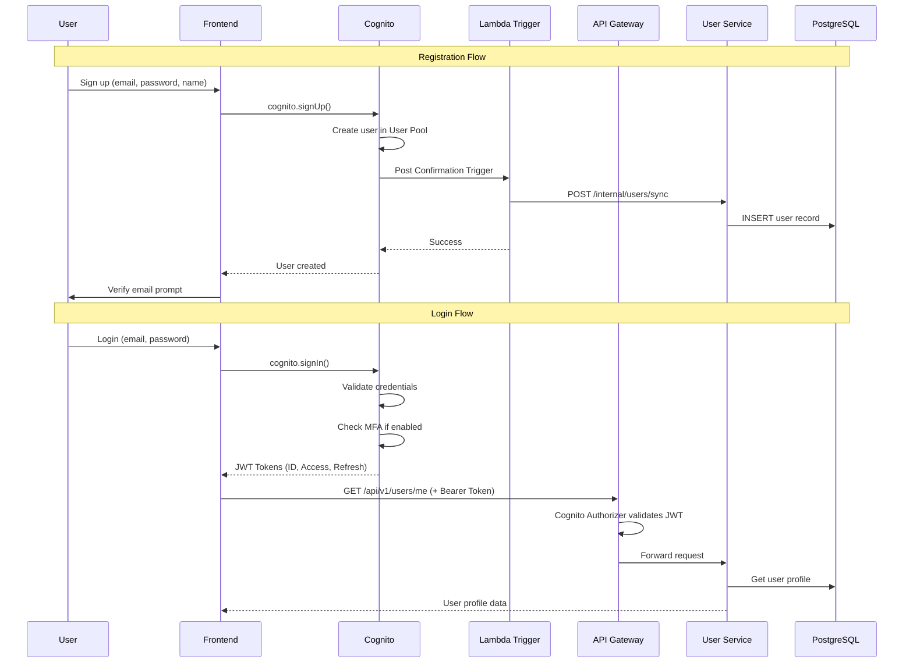

#AWS Cognito + API Gateway Authentication Plan

## Architecture Overview



---

## Recommended API Gateway Scope

Based on your architecture, I recommend **Hybrid Approach**:| Traffic Type | Gateway | Reason ||--------------|---------|--------|| Public APIs (Auth, Products, Search) | AWS API Gateway | Rate limiting, DDoS protection, Cognito integration || Internal APIs (Orders, Payments, Inventory) | Nginx Ingress | Lower latency, no additional cost || Service-to-Service | Direct via K8s Service | No gateway needed |

### Why Hybrid?

1. **Cost Control**: API Gateway charges per request ($3.50/million). Internal traffic stays free.
2. **Latency**: Internal calls don't add API Gateway hop (~20-50ms savings)
3. **Security**: Public APIs get AWS WAF, throttling, and DDoS protection
4. **Simplicity**: Existing Nginx setup continues for authenticated internal routes

---

## Implementation Architecture

### Component Responsibilities

| Component | Responsibility ||-----------|----------------|| **Cognito User Pool** | Authentication (login, register, MFA, social) || **Cognito Identity Providers** | Google, Facebook OAuth integration || **API Gateway** | Public API routing, rate limiting, request validation || **Cognito Authorizer** | JWT token validation at API Gateway || **Lambda Triggers** | Sync user data to PostgreSQL on signup/update || **User Service** | User profiles, addresses, preferences (PostgreSQL) |

### User Data Flow



---

## Cognito User Pool Configuration

### User Pool Settings

| Setting | Value | Reason ||---------|-------|--------|| **Sign-in Options** | Email | Primary identifier || **Password Policy** | Min 8 chars, uppercase, lowercase, number, symbol | Security || **MFA** | Optional (user choice) | User experience || **MFA Methods** | TOTP (Authenticator app), SMS | Flexibility || **Account Recovery** | Email only | Simpler UX || **Self-Registration** | Enabled | Customer signup || **Email Verification** | Required | Prevent fake accounts |

### Standard Attributes to Collect

| Attribute | Required | Synced to PostgreSQL ||-----------|----------|---------------------|| email | Yes | Yes || name | Yes | Yes (split to first/last) || phone_number | No | Yes || picture | No | Yes (for social login) |

### Custom Attributes

| Attribute | Type | Purpose ||-----------|------|---------|| custom:role | String | Customer, Seller, Admin || custom:postgres_id | String | Link to PostgreSQL user ID |---

## Identity Provider Setup

### Google OAuth 2.0

| Setting | Value ||---------|-------|| Provider | Google || Client ID | From Google Cloud Console || Client Secret | From Google Cloud Console || Scopes | openid, email, profile || Attribute Mapping | email→email, name→name, picture→picture |

### Facebook OAuth 2.0

| Setting | Value ||---------|-------|| Provider | Facebook || App ID | From Facebook Developers || App Secret | From Facebook Developers || Scopes | public_profile, email || Attribute Mapping | email→email, name→name |---

## API Gateway Configuration

### Endpoints via API Gateway

| Method | Path | Auth | Backend ||--------|------|------|---------|| POST | /auth/register | None | Cognito (direct) || POST | /auth/login | None | Cognito (direct) || POST | /auth/forgot-password | None | Cognito (direct) || GET | /api/v1/products | None | Product Service || GET | /api/v1/products/{id} | None | Product Service || GET | /api/v1/products/search | None | Search Service || GET | /api/v1/users/me | Cognito JWT | User Service || PUT | /api/v1/users/me | Cognito JWT | User Service ||  *| /api/v1/orders/* | Cognito JWT | Order Service ||  *| /api/v1/cart/* | Cognito JWT | Cart Service |

### API Gateway Features to Enable

| Feature | Configuration ||---------|---------------|| **Throttling** | 1000 requests/second (burst: 2000) || **Quota** | 10,000 requests/day per user || **WAF** | Enable AWS WAF with managed rules || **Caching** | Enable for GET /products (5 min TTL) || **CORS** | Allow amcart.com origins || **Logging** | CloudWatch access logs |---

## Lambda Triggers for User Sync

### Post Confirmation Trigger (New User)

```csharp
// Pseudocode - Lambda function
public async Task Handler(CognitoPostConfirmationEvent event)
{
    var user = new UserSyncRequest
    {
        CognitoSub = event.Request.UserAttributes["sub"],
        Email = event.Request.UserAttributes["email"],
        Name = event.Request.UserAttributes["name"],
        Provider = event.Request.UserAttributes["identities"] != null 
            ? "social" : "email",
        EmailVerified = true
    };
    
    await httpClient.PostAsync(
        "https://internal-api/users/sync", 
        JsonContent.Create(user)
    );
}
```


### Triggers to Implement

| Trigger | Purpose ||---------|---------|| **Post Confirmation** | Create user in PostgreSQL after email verification || **Post Authentication** | Update last_login timestamp || **Pre Token Generation** | Add custom claims (role, postgres_id) to JWT |---

## Drawbacks and Mitigations

### Drawback 1: Vendor Lock-in

| Issue | Cognito is AWS-specific ||-------|------------------------|| **Impact** | Difficult to migrate to another cloud || **Mitigation** | Keep user data in PostgreSQL; Cognito only for auth tokens. Can replace with Auth0/Keycloak if needed. |

### Drawback 2: Limited Customization

| Issue | Cannot customize login UI in Hosted UI ||-------|--------------------------------------|| **Impact** | Branded experience requires custom UI || **Mitigation** | Use Amplify SDK with custom UI (recommended). Skip Hosted UI entirely. |

### Drawback 3: Cold Start Latency

| Issue | Lambda triggers have cold start (~200-500ms) ||-------|---------------------------------------------|| **Impact** | First login after idle period is slower || **Mitigation** | Use Provisioned Concurrency for critical Lambdas; keep Lambdas warm with scheduled pings. |

### Drawback 4: Cost at Scale

| Issue | Per-MAU pricing can be expensive ||-------|--------------------------------|| **Impact** | $0.0055/MAU after 50K free tier || **Mitigation** | Still cheaper than building + maintaining custom auth. 100K MAU = $275/month. |

### Drawback 5: Complex Token Refresh

| Issue | Token refresh logic in frontend ||-------|-------------------------------|| **Impact** | Need to handle token expiry gracefully || **Mitigation** | Amplify SDK handles automatically. Configure longer token expiry (1 hour). |

### Drawback 6: Limited User Search

| Issue | Cognito ListUsers API is limited ||-------|--------------------------------|| **Impact** | Cannot search users efficiently for admin panel || **Mitigation** | Query PostgreSQL for user management. Cognito is auth-only. |---

## Migration Strategy

### Phase 1: Setup (Week 1)

1. Create Cognito User Pool with settings
2. Configure Google and Facebook identity providers
3. Set up API Gateway with Cognito Authorizer
4. Create Lambda triggers for user sync

### Phase 2: Integration (Week 2)

1. Add internal sync endpoint to User Service
2. Update Nuxt.js frontend with Amplify SDK
3. Implement custom login/register UI
4. Test MFA flows

### Phase 3: Migration (Week 3)

1. Migrate existing users to Cognito (with temp passwords)
2. Force password reset on first login
3. Run parallel auth (old JWT + Cognito) during migration
4. Monitor and fix issues

### Phase 4: Cutover (Week 4)

1. Disable old JWT authentication
2. Update all services to validate Cognito tokens
3. Remove legacy auth code
4. Document new auth flows

---

## Cost Estimate