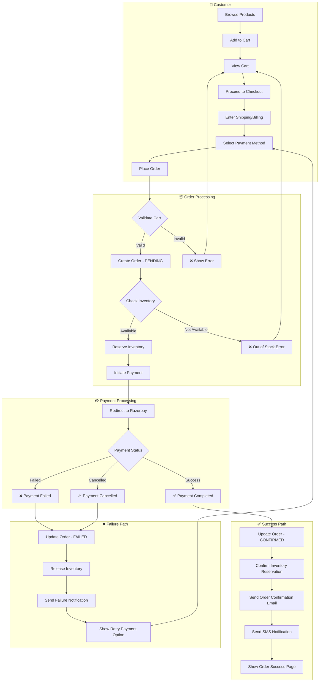
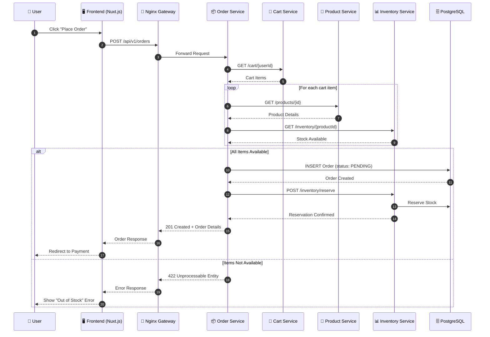
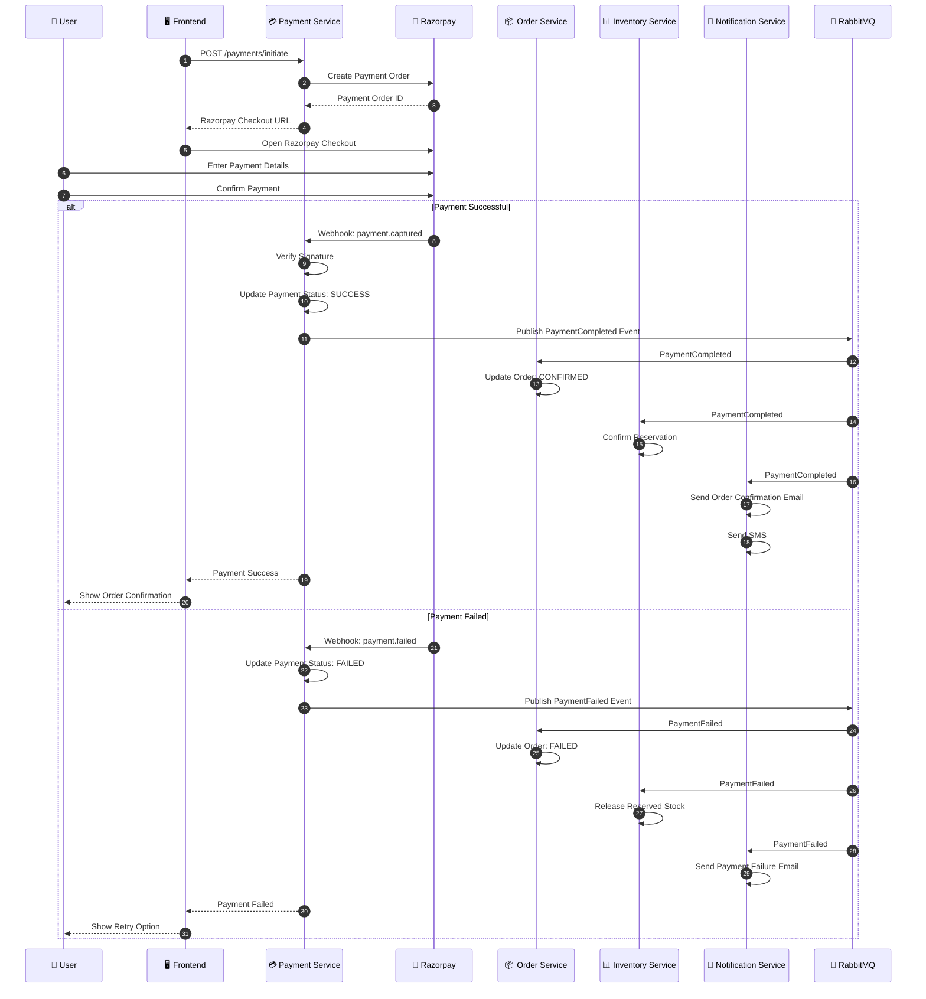
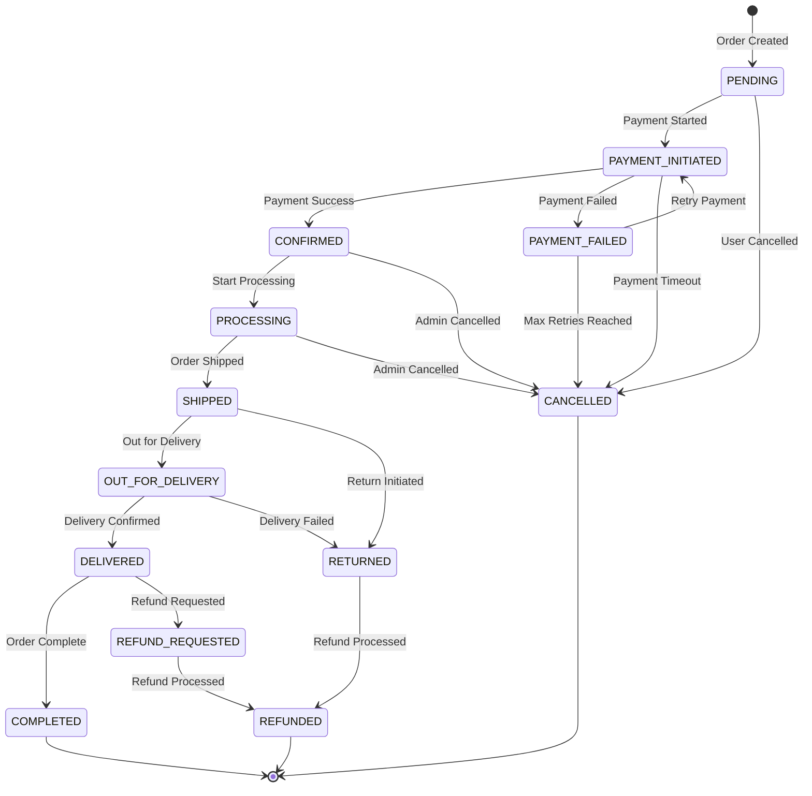
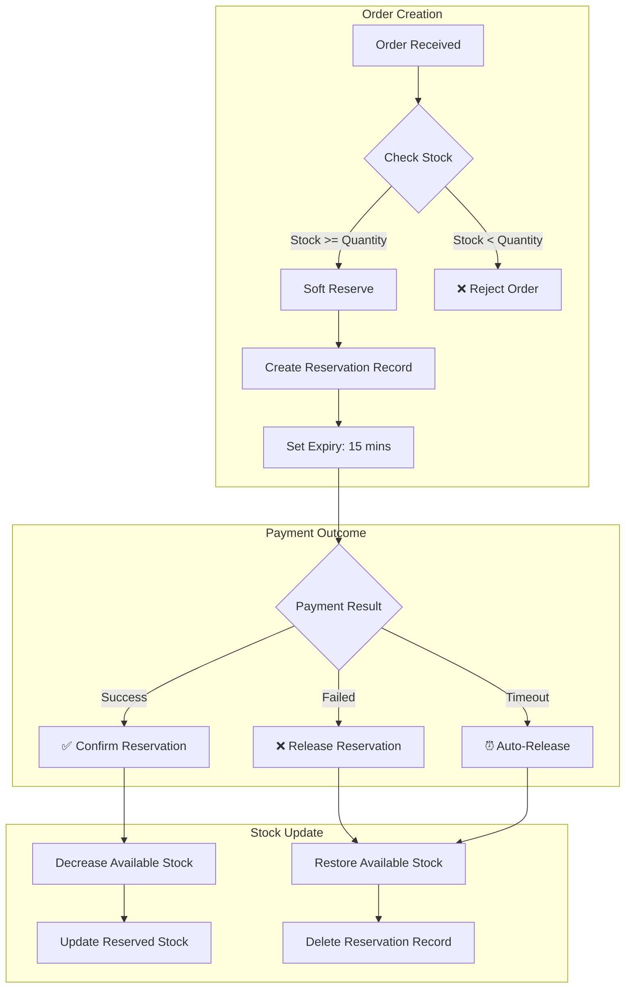
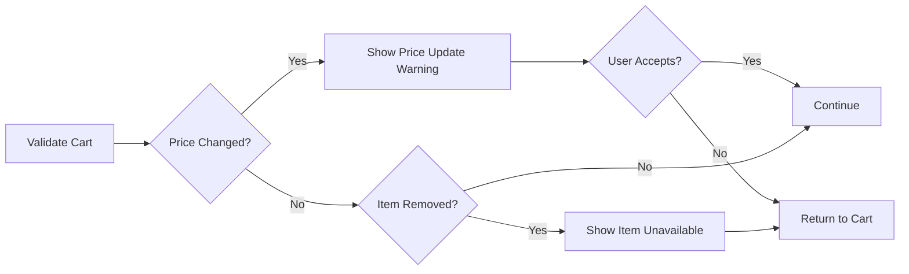
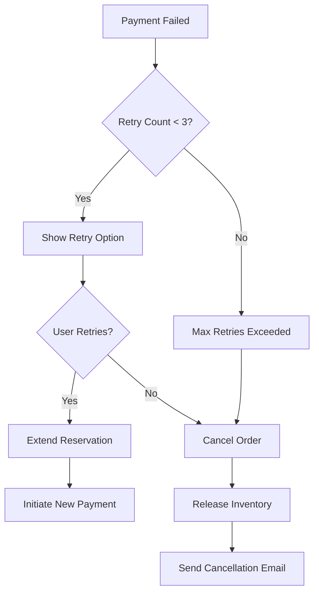
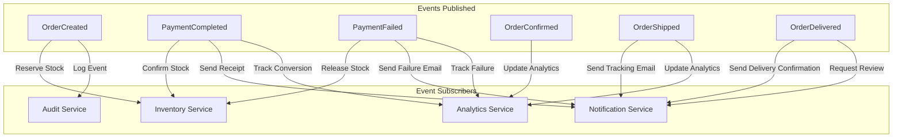

# AmCart Order Flow Diagram

This document describes the complete order flow for the AmCart ecommerce platform, including both successful and failure scenarios.

---

## 1. High-Level Order Flow

---

## 2. Detailed Order Creation Flow

---

## 3. Payment Processing Flow

---

## 4. Order State Machine

---

## 5. Inventory Reservation Flow

---

## 6. Error Handling Scenarios

### 6.1 Cart Validation Errors

### 6.2 Payment Retry Flow

---

## 7. Event-Driven Order Flow

---

## 8. Order API Endpoints

| Endpoint | Method | Description | Success | Failure |
|----------|--------|-------------|---------|---------|
| `/orders` | POST | Create new order | 201 Created | 400/422 Error |
| `/orders/{id}` | GET | Get order details | 200 OK | 404 Not Found |
| `/orders/{id}/cancel` | POST | Cancel order | 200 OK | 400/409 Error |
| `/orders/{id}/payment` | POST | Initiate payment | 200 + Redirect | 400 Error |
| `/orders/{id}/payment/verify` | POST | Verify payment | 200 OK | 400 Error |
| `/orders/{id}/status` | PATCH | Update status (Admin) | 200 OK | 400/403 Error |

---

## 9. Order Status Reference

| Status | Description | Next States | Actions |
|--------|-------------|-------------|---------|
| `PENDING` | Order created, awaiting payment | PAYMENT_INITIATED, CANCELLED | Reserve inventory |
| `PAYMENT_INITIATED` | Payment in progress | CONFIRMED, PAYMENT_FAILED, CANCELLED | Wait for webhook |
| `PAYMENT_FAILED` | Payment failed | PAYMENT_INITIATED, CANCELLED | Allow retry |
| `CONFIRMED` | Payment successful | PROCESSING, CANCELLED | Confirm inventory |
| `PROCESSING` | Order being prepared | SHIPPED, CANCELLED | Prepare shipment |
| `SHIPPED` | Order shipped | OUT_FOR_DELIVERY, RETURNED | Update tracking |
| `OUT_FOR_DELIVERY` | With delivery agent | DELIVERED, RETURNED | Track delivery |
| `DELIVERED` | Order delivered | COMPLETED, REFUND_REQUESTED | Confirm delivery |
| `COMPLETED` | Order complete | - | Archive |
| `CANCELLED` | Order cancelled | - | Release inventory, refund |
| `REFUND_REQUESTED` | Refund requested | REFUNDED | Process refund |
| `REFUNDED` | Refund processed | - | Archive |
| `RETURNED` | Order returned | REFUNDED | Process return |

---

## 10. Timeout and Expiry Rules

| Scenario | Timeout | Action |
|----------|---------|--------|
| Inventory Reservation | 15 minutes | Auto-release if payment not completed |
| Payment Session | 10 minutes | Cancel payment, show timeout |
| Order Pending | 30 minutes | Auto-cancel if payment not initiated |
| Payment Retry | 24 hours | Max window to retry failed payment |
| Refund Processing | 5-7 business days | Complete refund to original payment method |

---

## 11. Notification Triggers

| Event | Email | SMS | Push |
|-------|-------|-----|------|
| Order Created | ✅ | ❌ | ✅ |
| Payment Success | ✅ | ✅ | ✅ |
| Payment Failed | ✅ | ❌ | ✅ |
| Order Shipped | ✅ | ✅ | ✅ |
| Out for Delivery | ❌ | ✅ | ✅ |
| Delivered | ✅ | ✅ | ✅ |
| Refund Processed | ✅ | ✅ | ✅ |

---

*Last Updated: December 2024*

