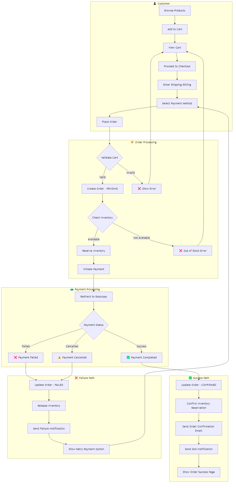
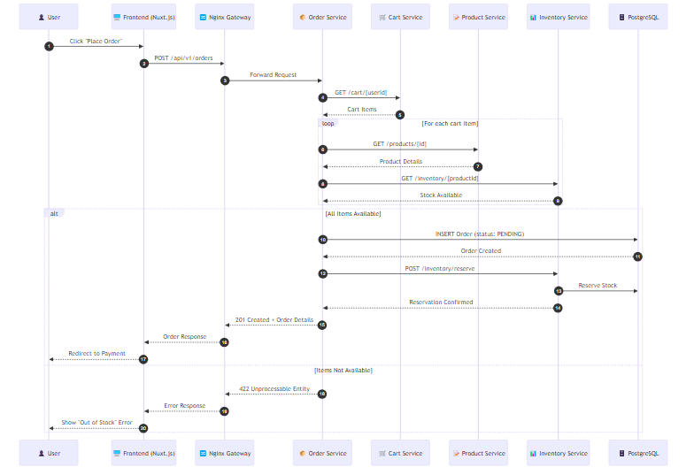
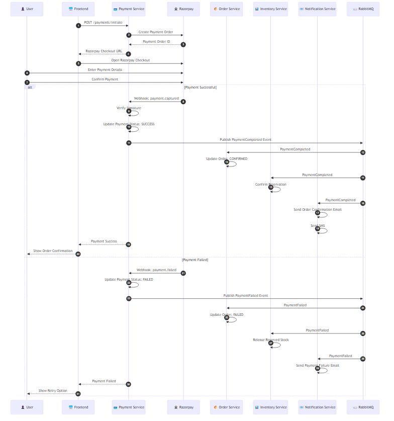
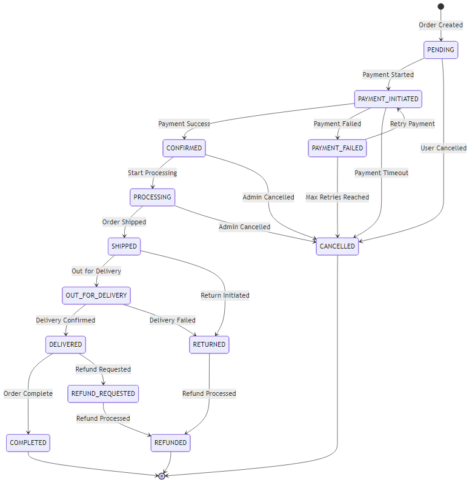
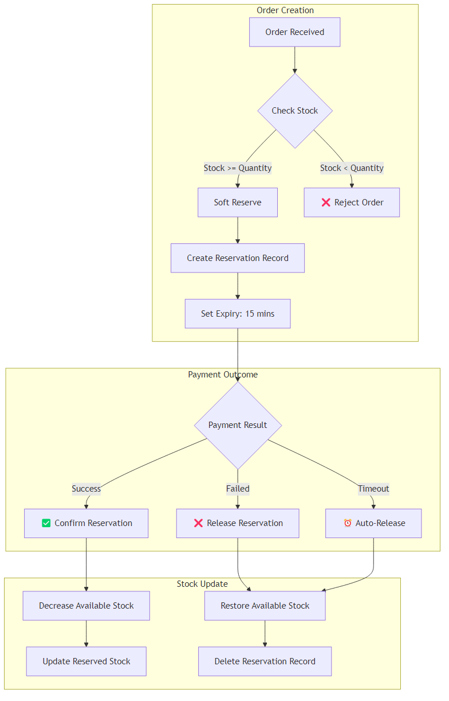
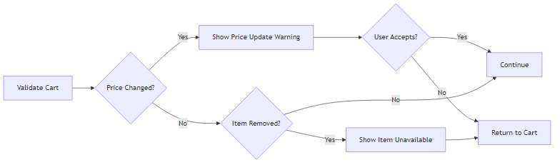
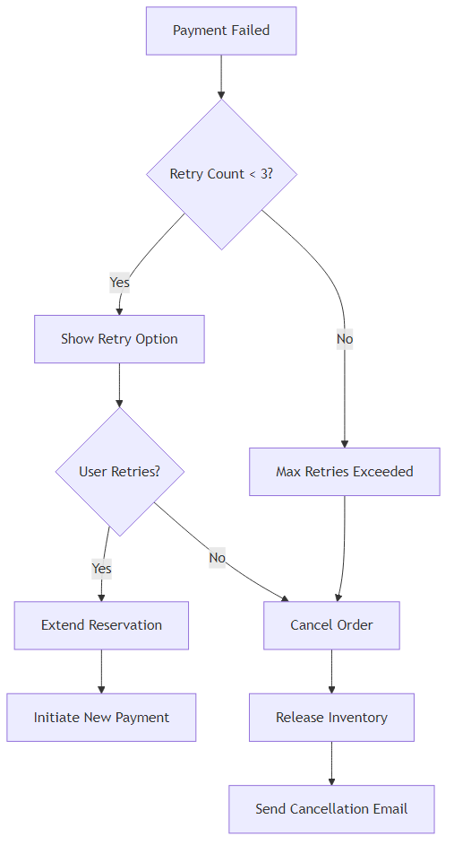
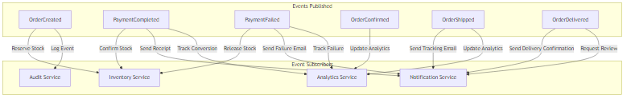

# AmCart Order Flow Diagrams - Images

This document contains PNG images of all order flow diagrams for the AmCart ecommerce platform.

> **Note**: These images were generated from Mermaid diagrams. Source files are in `docs/diagrams/mermaid/`

---

## 1. High-Level Order Flow

Shows the complete customer journey from browsing to order success/failure.



**Key Paths:**
- ✅ **Success Path**: Order → Payment → Confirmation → Notification → Success Page
- ❌ **Failure Path**: Payment Failed → Release Inventory → Notification → Retry Option

---

## 2. Order Creation Flow (Sequence Diagram)

Detailed service interactions when creating an order.



**Services Involved:**
- Frontend (Nuxt.js)
- Nginx Gateway
- Order Service
- Cart Service
- Product Service
- Inventory Service
- PostgreSQL Database

---

## 3. Payment Processing Flow (Sequence Diagram)

Complete payment flow with Razorpay integration, showing both success and failure scenarios.



**Flow Highlights:**
- Payment initiation via Razorpay
- Webhook handling for payment status
- Event publishing to RabbitMQ
- Parallel notifications to Order, Inventory, and Notification services

---

## 4. Order State Machine

All possible order states and transitions.



**States:**
- PENDING → PAYMENT_INITIATED → CONFIRMED → PROCESSING → SHIPPED → DELIVERED → COMPLETED
- Failure states: PAYMENT_FAILED, CANCELLED, RETURNED, REFUNDED

---

## 5. Inventory Reservation Flow

How inventory is reserved during checkout and released on payment failure.



**Key Points:**
- Soft reserve on order creation
- 15-minute expiry for reservation
- Auto-release on timeout or payment failure
- Confirm reservation on payment success

---

## 6. Cart Validation Errors

Error handling for cart validation issues.



**Handled Scenarios:**
- Price changes since adding to cart
- Items removed/out of stock

---

## 7. Payment Retry Flow

How failed payments are handled with retry logic.



**Rules:**
- Maximum 3 payment retries
- Reservation extended on each retry
- Order cancelled after max retries exceeded

---

## 8. Event-Driven Order Flow

Events published during order lifecycle and their subscribers.



**Events:**
- OrderCreated
- PaymentCompleted
- PaymentFailed
- OrderConfirmed
- OrderShipped
- OrderDelivered

**Subscribers:**
- Inventory Service (stock management)
- Notification Service (emails, SMS)
- Analytics Service (tracking)
- Audit Service (logging)

---

## Image Files Location

All PNG images are stored in:
```
docs/diagrams/images/
├── 01-high-level-order-flow.png
├── 02-order-creation-flow.png
├── 03-payment-processing-flow.png
├── 04-order-state-machine.png
├── 05-inventory-reservation-flow.png
├── 06-cart-validation-errors.png
├── 07-payment-retry-flow.png
└── 08-event-driven-order-flow.png
```

## Mermaid Source Files

Source `.mmd` files are in:
```
docs/diagrams/mermaid/
├── 01-high-level-order-flow.mmd
├── 02-order-creation-flow.mmd
├── 03-payment-processing-flow.mmd
├── 04-order-state-machine.mmd
├── 05-inventory-reservation-flow.mmd
├── 06-cart-validation-errors.mmd
├── 07-payment-retry-flow.mmd
└── 08-event-driven-order-flow.mmd
```

## Regenerating Images

To regenerate images, run:
```bash
cd docs/diagrams
npx @mermaid-js/mermaid-cli -i mermaid/<filename>.mmd -o images/<filename>.png -b white
```

Or regenerate all:
```bash
for file in mermaid/*.mmd; do
  npx @mermaid-js/mermaid-cli -i "$file" -o "images/$(basename "$file" .mmd).png" -b white
done
```

---

*Generated: January 2026*

