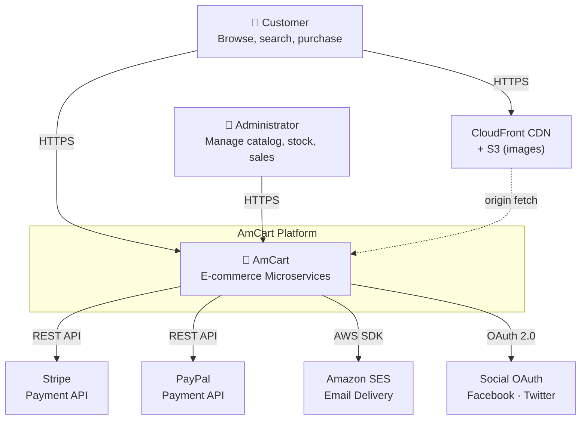
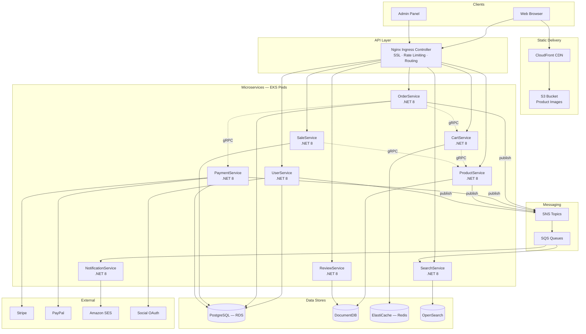
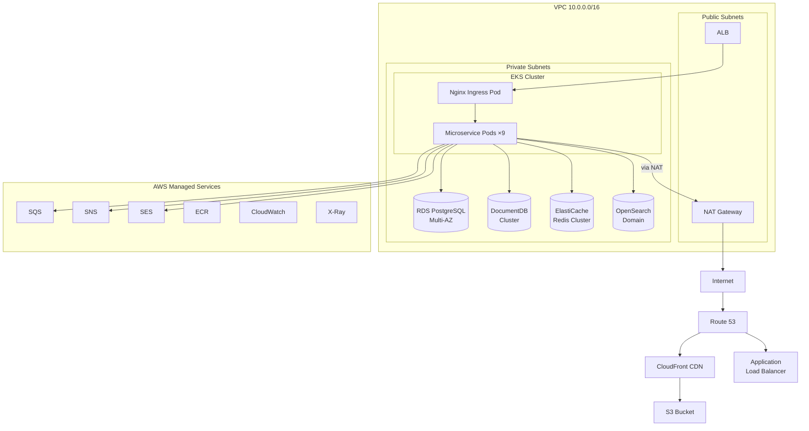
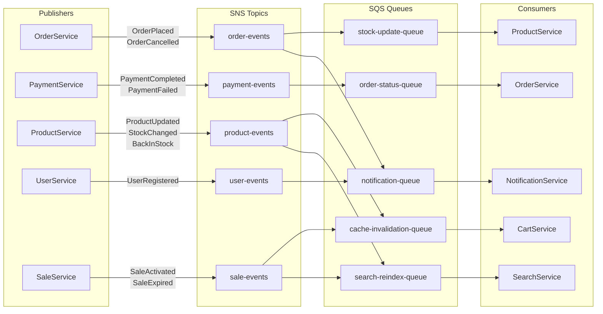

# AmCart Architecture Design

Enterprise-grade microservices architecture for the AmCart e-commerce platform, deployed on AWS with polyglot persistence.

## Architecture Decisions Record

| # | Decision | Choice | Rationale |
|---|----------|--------|-----------|
| 1 | Cloud Provider | **AWS** | Mature ecosystem, broadest service catalog, EKS for Kubernetes |
| 2 | Container Orchestration | **EKS (Kubernetes)** | Industry standard, auto-scaling, self-healing, service discovery built-in |
| 3 | API Gateway | **Nginx Ingress Controller** | Full control, path-based routing, SSL termination, rate limiting via annotations |
| 4 | Service Granularity | **Fine-grained (9 services)** | Clear domain boundaries, independent deployability, team autonomy |
| 5 | Sync Communication | **REST (external) + gRPC (internal)** | REST for browser clients; gRPC for fast, typed service-to-service calls |
| 6 | Async Communication | **Amazon SNS + SQS** | Serverless, zero-ops, fan-out via SNS topics → SQS queues per consumer |
| 7 | Auth | **Custom JWT UserService** | Already built, full control, portable across cloud providers |
| 8 | Databases | **Polyglot persistence** | PostgreSQL (ACID), DocumentDB (flexible docs), ElastiCache (speed), OpenSearch (search) |
| 9 | Payment | **Stripe + PayPal** | Multi-provider for customer choice; Stripe for cards, PayPal for wallet users |
| 10 | Static Assets | **S3 + CloudFront CDN** | Global low-latency delivery, cost-effective, infinite scale |
| 11 | Email | **Amazon SES** | AWS-native, high deliverability, cost-effective at scale |
| 12 | Container Registry | **Amazon ECR** | Native EKS integration, no extra auth setup |

---

## Microservice Inventory

| Service | Domain | Responsibilities | Data Store | Protocol | Publishes Events |
|---------|--------|-----------------|------------|----------|-----------------|
| **UserService** | User | Auth, registration, login, social OAuth, profile, addresses | PostgreSQL (RDS) | REST + gRPC | `UserRegistered` |
| **ProductService** | Product | Product CRUD, categories, brands, tags, stock management | DocumentDB | REST + gRPC | `ProductUpdated`, `StockChanged`, `BackInStock` |
| **CartService** | Cart | Add/remove/update items, apply coupon, cart totals | ElastiCache (Redis) | REST + gRPC | — |
| **OrderService** | Order | Checkout orchestration, order lifecycle, order history | PostgreSQL (RDS) | REST + gRPC | `OrderPlaced`, `OrderCancelled` |
| **PaymentService** | Payment | Payment processing via Stripe/PayPal, refunds | PostgreSQL (RDS) | gRPC only (internal) | `PaymentCompleted`, `PaymentFailed` |
| **SearchService** | Search | Full-text search, faceted filtering, autocomplete | OpenSearch | REST | — |
| **SaleService** | Sale | Sales/discounts, coupon CRUD, rule engine | PostgreSQL (RDS) | REST + gRPC | `SaleActivated`, `SaleExpired` |
| **ReviewService** | Engagement | Reviews, testimonials, contact messages, newsletter | DocumentDB | REST | — |
| **NotificationService** | Cross-cutting | Email dispatch (order confirm, welcome, stock alerts) | SQS (consumer) → SES | Async (SQS) | — |

---

## System Context Diagram



---

## Services Architecture Diagram



---

## AWS Infrastructure Diagram



### AWS Service Mapping

| AWS Service | Purpose | Configuration |
|-------------|---------|---------------|
| **EKS** | Kubernetes cluster for all microservices | 2 `t3.medium` nodes (dev), auto-scaling group |
| **RDS PostgreSQL** | User, Order, Sale, Coupon, Payment data | `db.t3.micro` Multi-AZ, automated backups |
| **DocumentDB** | Product catalog, reviews, engagement data | `db.t3.medium`, MongoDB 5.0 compatible |
| **ElastiCache Redis** | Cart, sessions, product cache, stock counters | `cache.t3.micro`, cluster mode disabled |
| **OpenSearch** | Product search index, autocomplete | `t3.small.search`, 1 node (dev) |
| **S3** | Product images, static assets | Standard tier, lifecycle policy |
| **CloudFront** | CDN for S3 assets, HTTPS termination | Edge locations, cache TTL 24h |
| **SQS** | Event queues per consumer service | Standard queues, 14-day retention |
| **SNS** | Event fan-out topics | 4 topics (order, payment, product, user) |
| **SES** | Transactional email delivery | Verified domain, production access |
| **ECR** | Docker image registry | 1 repo per service, lifecycle policy |
| **Route 53** | DNS management | Alias records to ALB and CloudFront |
| **CloudWatch** | Logging, metrics, alarms | Container Insights enabled |
| **X-Ray** | Distributed tracing | SDK integration in each service |

---

## Event-Driven Architecture

### SNS Topics & SQS Queues



### Event Catalog

| Event | Publisher | Payload (key fields) | Consumers | Action |
|-------|-----------|---------------------|-----------|--------|
| `OrderPlaced` | OrderService | orderId, userId, items[], total | NotificationService, ProductService | Send confirmation email; decrement stock |
| `OrderCancelled` | OrderService | orderId, items[] | ProductService | Restore stock |
| `PaymentCompleted` | PaymentService | orderId, transactionId, amount | OrderService | Update order status to Confirmed |
| `PaymentFailed` | PaymentService | orderId, reason | OrderService | Update order status to PaymentFailed |
| `ProductUpdated` | ProductService | productId, changedFields | SearchService, CartService | Reindex in OpenSearch; invalidate Redis cache |
| `StockChanged` | ProductService | productId, oldQty, newQty | — (logged) | Audit trail |
| `BackInStock` | ProductService | productId, productName | NotificationService | Email wishlist users |
| `UserRegistered` | UserService | userId, email, firstName | NotificationService | Send welcome email |
| `SaleActivated` | SaleService | saleId, categoryIds[], discount | SearchService, CartService | Reindex with discount prices; invalidate cache |
| `SaleExpired` | SaleService | saleId, categoryIds[] | SearchService, CartService | Reindex with normal prices; invalidate cache |

---

## Communication Patterns

### Synchronous (REST / gRPC)

| From | To | Protocol | Route / Method | When |
|------|----|----------|---------------|------|
| Browser | Nginx | REST | `*` | All client requests |
| Nginx | Any Service | REST | Path-based: `/api/v1/users/*` → UserService | Every API call |
| OrderService | CartService | gRPC | `GetCart(userId)` | Checkout: fetch cart items |
| OrderService | PaymentService | gRPC | `ProcessPayment(orderId, method, amount)` | Checkout: charge customer |
| CartService | ProductService | gRPC | `GetProduct(productId)`, `ValidatePrice(productId)` | Add to cart: verify product exists & price |
| SaleService | ProductService | gRPC | `ApplyDiscount(productId, discount)` | Sale activated: update product prices |

### Asynchronous (SNS → SQS)

See **Event-Driven Architecture** section above. All async communication flows through SNS topics fanning out to SQS queues. Each consuming service reads from its own dedicated queue.

---

## Cross-Cutting Concerns

| Concern | Implementation |
|---------|---------------|
| **Service Discovery** | Kubernetes DNS — each service is a `ClusterIP` Service (e.g. `user-service.default.svc.cluster.local`) |
| **Configuration** | Kubernetes `ConfigMap` (non-sensitive) + `Secret` (sensitive: DB passwords, JWT keys, API keys) |
| **Health Checks** | Kubernetes liveness (`/health/live`) and readiness (`/health/ready`) probes on each pod |
| **Logging** | Structured JSON logs → CloudWatch Container Insights; correlation ID propagated in headers |
| **Monitoring** | CloudWatch metrics + alarms; Prometheus + Grafana for Kubernetes-level metrics |
| **Distributed Tracing** | AWS X-Ray SDK in each service; trace ID propagated via `X-Amzn-Trace-Id` header |
| **Circuit Breaker** | Polly (.NET) for retry + circuit-breaker on gRPC calls and external API calls |
| **Rate Limiting** | Nginx Ingress annotations: `nginx.ingress.kubernetes.io/limit-rps` per route |
| **SSL/TLS** | AWS ACM certificate on ALB; Nginx Ingress handles TLS termination inside the cluster |
| **Auth Propagation** | JWT token validated by each service; user claims extracted from token; no inter-service auth re-validation |
| **API Versioning** | URL path versioning: `/api/v1/...`, `/api/v2/...` |
| **Idempotency** | Idempotency keys on payment and order creation endpoints to prevent duplicate processing |
| **CORS** | Configured at Nginx Ingress level for browser clients |

---

## Security Architecture

| Layer | Mechanism |
|-------|-----------|
| **Network** | VPC with public/private subnets; microservices in private subnets; NAT Gateway for outbound |
| **Ingress** | ALB in public subnet → Nginx Ingress in private subnet; Security Groups restrict port access |
| **Transport** | HTTPS everywhere; ACM certificate on ALB; gRPC over TLS for internal calls |
| **Authentication** | JWT tokens issued by UserService; validated per-request by each service |
| **Authorization** | Role-based (Customer/Administrator) from JWT claims; Admin endpoints restricted |
| **Secrets** | Kubernetes Secrets (encrypted at rest via EKS envelope encryption); rotate via AWS Secrets Manager |
| **Data at Rest** | RDS encryption enabled; DocumentDB encryption enabled; S3 SSE-S3 |
| **Payment** | PCI compliance delegated to Stripe/PayPal (never store card numbers); tokenized payment IDs only |
| **Container** | Non-root user in Dockerfiles; read-only root filesystem; resource limits per pod |

---

## Checkout Flow (Orchestration Example)

This shows how the OrderService orchestrates a checkout across multiple services:

```
1. Client → POST /api/v1/orders/checkout
2. Nginx → OrderService
3. OrderService → CartService (gRPC): GetCart(userId)
4. OrderService → SaleService (gRPC): ValidateDiscounts(items)
5. OrderService → PaymentService (gRPC): ProcessPayment(orderId, method, amount)
6. PaymentService → Stripe/PayPal (REST): charge
7. PaymentService → SNS: publish PaymentCompleted
8. OrderService → PostgreSQL: INSERT Order + OrderItems
9. OrderService → SNS: publish OrderPlaced
10. SNS → SQS (notification-queue) → NotificationService → SES: send email
11. SNS → SQS (stock-update-queue) → ProductService: DECR stock in MongoDB + Redis
12. OrderService → CartService (gRPC): ClearCart(userId)
13. OrderService → Client: 201 Created { orderId, orderNumber }
```

---

## draw.io Diagrams

| File | Description |
|------|-------------|
| [services-diagram.drawio](services-diagram.drawio) | Main architecture: all 9 microservices, 4 data stores, messaging, external integrations |
| [aws-infrastructure.drawio](aws-infrastructure.drawio) | AWS cloud layout: VPC, EKS, RDS, DocumentDB, ElastiCache, OpenSearch, S3, CloudFront |
| [event-flow.drawio](event-flow.drawio) | Event-driven patterns: SNS topics, SQS queues, publishers, consumers |

Open any `.drawio` file in [app.diagrams.net](https://app.diagrams.net) via **File → Open from → Device**.
