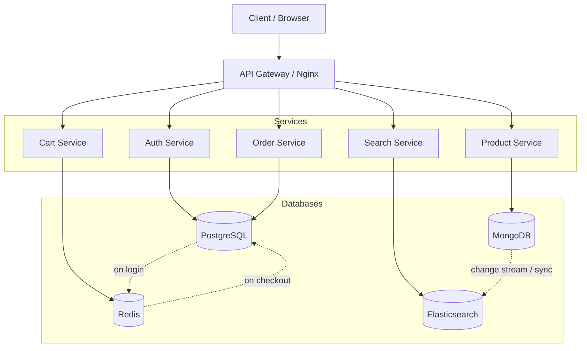

# AmCart Enterprise Database Architecture & ERD Diagrams

Polyglot persistence design using four database technologies, each chosen for the workload it handles best.

## Architecture Overview

| Database | Colour in Diagrams | Domains / Use Cases | Why This Database |
|----------|--------------------|---------------------|-------------------|
| **PostgreSQL** | Blue | User, Order, Sale, Coupon | ACID transactions for financial data; FK constraints for referential integrity; mature .NET/EF Core support |
| **MongoDB** | Green | Product Catalog, Engagement (reviews, wishlists, testimonials, etc.) | Flexible document schema for varying product attributes; embedded sub-documents eliminate JOINs; horizontal scaling via sharding |
| **Redis** | Red | Cart, Sessions, Cache, Stock Counters, Rate Limiting | Sub-millisecond reads; atomic operations (INCR/DECR); TTL-based expiry for ephemeral data |
| **Elasticsearch** | Purple | Product Search & Filtering | Full-text search with relevance scoring; faceted filtering (price, colour, brand, size); autocomplete with edge n-gram |

## Data Flow

## Detailed Database Rationale

### PostgreSQL — Transactional Core

**Domains**: User, Order, Sale, Coupon

- ACID transactions ensure no double-charging, accurate stock deduction, consistent order state
- Foreign key constraints enforce referential integrity (User → Address, Order → OrderItem → Payment)
- Complex JOINs for order reports, sales analytics, user management
- `jsonb` columns for flexible sale-rule conditions
- EF Core migrations and LINQ for .NET integration

### MongoDB — Document Store

**Domains**: Product Catalog, Engagement (Reviews, Wishlists, Testimonials, Contact, Newsletter)

- **Product catalog**: Each product is a self-contained document with embedded category, brand, images, and tags — one read fetches everything needed to render a product page
- **Varying attributes**: Clothing has size/colour; watches have dial type/strap material; accessories have different specs — MongoDB's schema-less nature handles this without nullable columns
- **Engagement data**: Reviews, testimonials, and contact messages are naturally document-shaped with no need for complex JOINs
- **Wishlists**: Embedded array of product references per user — fast single-document reads
- **Horizontal scaling**: Shard by category or product ID when catalog grows

### Redis — In-Memory Data Store

**Use Cases**: Shopping Cart, User Sessions, Product Cache, Stock Counters, Rate Limiting

- **Shopping cart**: Hash per cart with JSON items array; sub-ms reads; TTL for abandoned guest carts (7-day expiry)
- **User sessions**: Store JWT claims for fast validation without PostgreSQL roundtrip
- **Product cache**: Cache hot product documents to reduce MongoDB reads (15-min TTL)
- **Stock counters**: Atomic `DECR` on purchase, `INCR` on restock — no race conditions even under concurrent load
- **Rate limiting**: Sliding-window counters per IP/endpoint using Sorted Sets

### Elasticsearch — Search Engine

**Use Cases**: Product Search, Faceted Filtering, Autocomplete

- Full-text search across product name, description, brand with BM25 relevance scoring
- Faceted filters: price range, colour, size, brand, tags — all as `keyword` fields for exact-match aggregation
- Autocomplete via `edge_ngram` analyzer on name and brand fields
- Boost newer products, in-stock items, and higher-rated products in relevance scoring
- Near-real-time indexing from MongoDB via change streams or a scheduled sync job

## Cross-Database Sync Patterns

| Source | Target | Method | Trigger |
|--------|--------|--------|---------|
| MongoDB `products` | Elasticsearch `products` index | Change stream listener or scheduled job | Product create / update / delete |
| Redis cart | PostgreSQL `Order` + `OrderItem` | Application code during checkout | User places order |
| PostgreSQL `User` | Redis session | Application code | User logs in |
| MongoDB `product.stockQuantity` | Redis `stock:{productId}` | Event + periodic reconciliation | Restock event, hourly sync |

**Important**: Cross-database references (e.g. `OrderItem.ProductId` referencing a MongoDB document) are maintained at the **application level**, not via database constraints. The application must ensure consistency through idempotent sync and eventual consistency patterns.

## ERD Files

### PostgreSQL (relational ERDs)

| File | Entities |
|------|----------|
| [postgresql-user-domain.drawio](postgresql-user-domain.drawio) | User, Address, PasswordResetToken |
| [postgresql-order-domain.drawio](postgresql-order-domain.drawio) | Order, OrderItem, Payment, Shipment, Coupon |
| [postgresql-sale-domain.drawio](postgresql-sale-domain.drawio) | Sale, SaleRule |

### MongoDB (document schema diagrams)

| File | Collections |
|------|-------------|
| [mongodb-product-catalog.drawio](mongodb-product-catalog.drawio) | products, categories, brands, tags |
| [mongodb-engagement.drawio](mongodb-engagement.drawio) | reviews, wishlists, compare_sessions, testimonials, contact_messages, newsletter_subscriptions |

### Redis (data structure diagrams)

| File | Key Patterns |
|------|-------------|
| [redis-data-structures.drawio](redis-data-structures.drawio) | cart:\*, session:\*, cache:product:\*, stock:\*, popular:products, ratelimit:\* |

### Elasticsearch (index mapping diagrams)

| File | Indices |
|------|---------|
| [elasticsearch-product-index.drawio](elasticsearch-product-index.drawio) | products index (mappings + settings + sync pattern) |

## How to open in draw.io

1. Go to [app.diagrams.net](https://app.diagrams.net)
2. **File → Open from → Device**
3. Select any `.drawio` file
4. Each database type uses a distinct colour scheme for easy identification

## Comparison with Single-DB Design

See [DatabaseERD/](../DatabaseERD/README.md) for the simpler single-PostgreSQL design. That approach is suitable for learning, small-scale deployments, and free-tier hosting. This enterprise design adds operational complexity but provides:

- Better read performance (Redis cache, Elasticsearch search)
- Flexible product schema (MongoDB)
- Horizontal scaling path (MongoDB sharding, Redis clustering, ES shards)
- Separation of concerns (each DB optimised for its workload)
