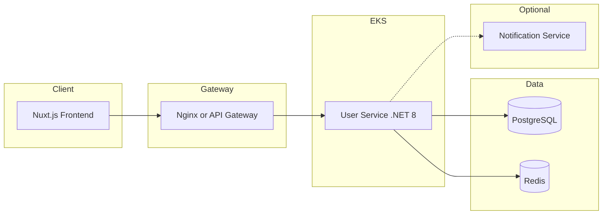
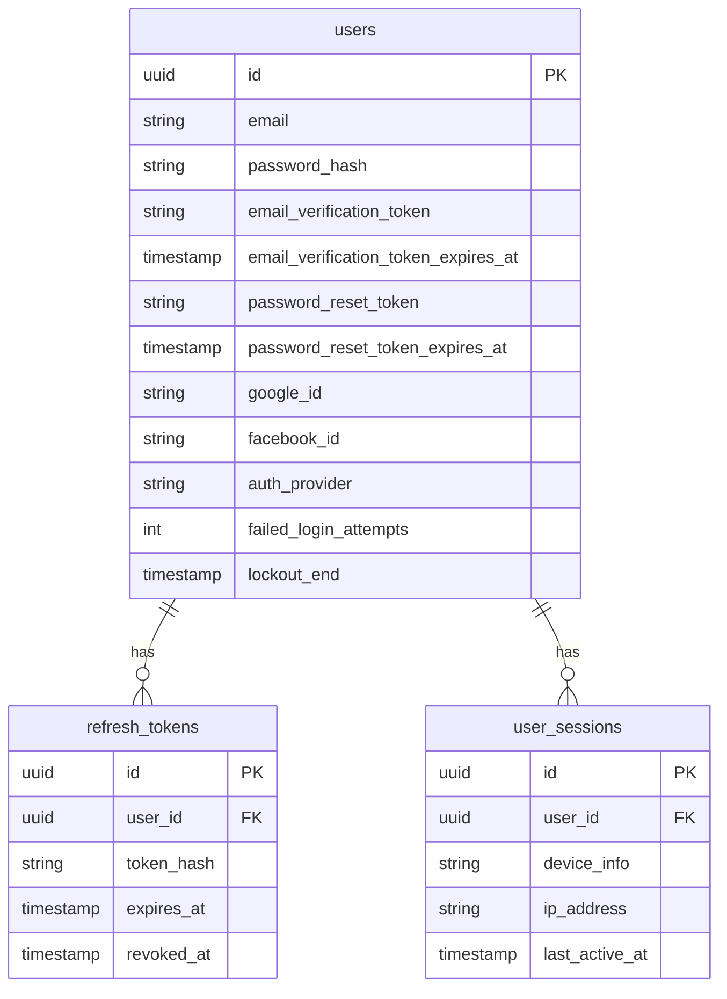
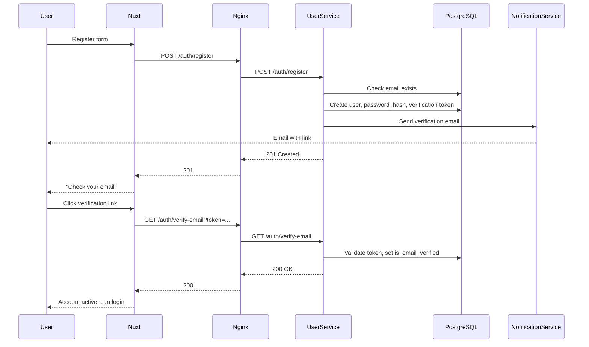
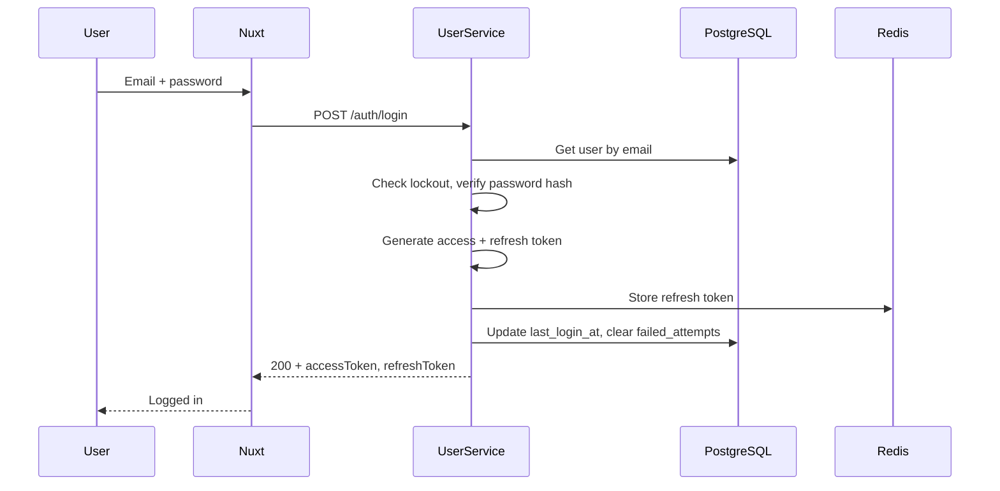
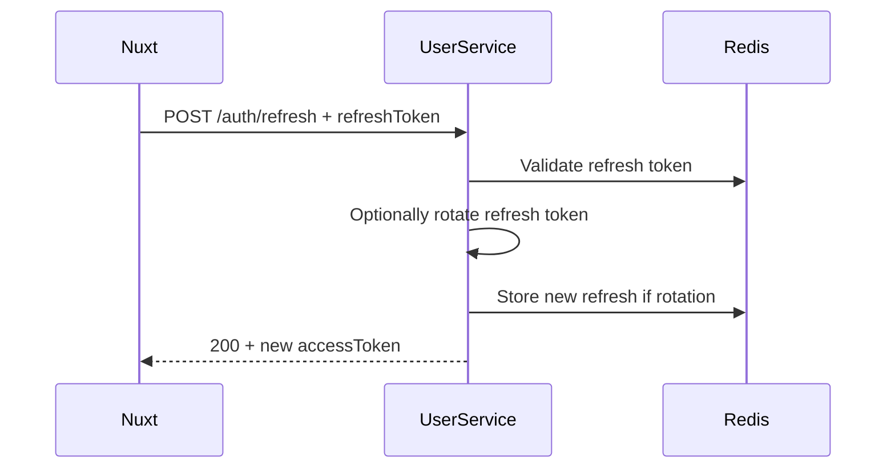
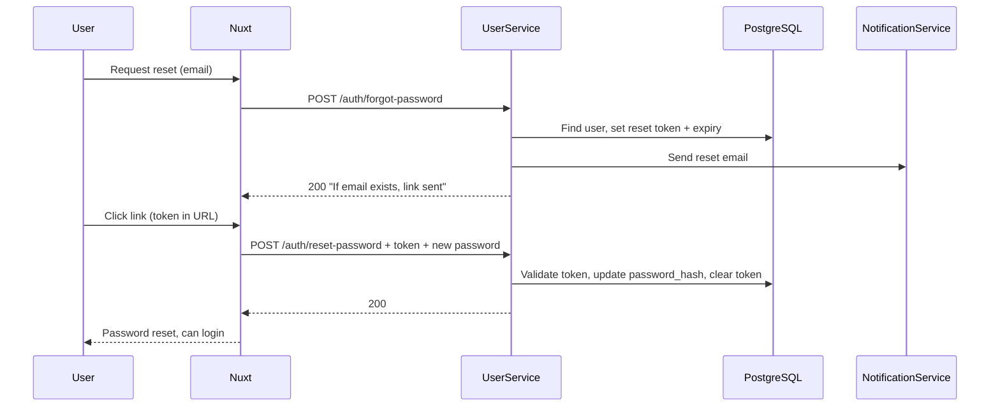
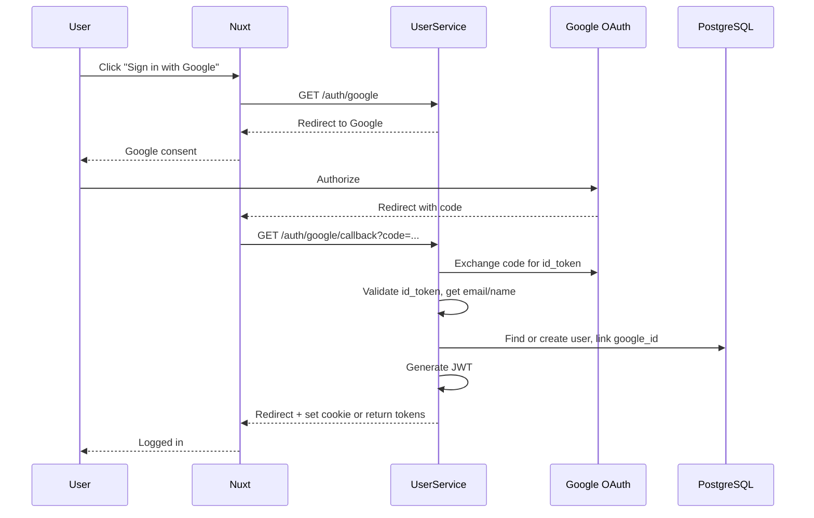

# Technical Design: Custom User Service Authentication

## Overview

This document describes the architecture and implementation approach for the **custom User Service** that performs all authentication for AmCart without AWS Cognito. The User Service owns credentials, JWT issuance and validation, refresh tokens, email verification, password reset, and optional social login (Google/Facebook).

### Goals

- **Full ownership of credentials** – Passwords hashed and stored in PostgreSQL; no third-party identity store.
- **JWT issuance and validation** – User Service issues access and refresh tokens; other services or the gateway validate JWTs using a shared secret or JWKS.
- **Same UX as SRS** – Login, register, social login, password reset, email verification, optional MFA and "Remember me."

### Out of Scope

- **Authorization** – Which user can do what (e.g. role checks) is handled inside each microservice; this design covers only "who is this user?"
- **Payment security** – Covered separately.
- **Admin auth** – Same User Service, different role (e.g. `admin`); no separate system here.

---

## Table of Contents

1. [Architecture](#1-architecture)
2. [Database Schema Changes](#2-database-schema-changes)
3. [API Surface](#3-api-surface)
4. [Authentication Flows](#4-authentication-flows)
5. [Security](#5-security)
6. [Integration with Rest of AmCart](#6-integration-with-rest-of-amcart)
7. [Optional: MFA and Social Login](#7-optional-mfa-and-social-login)
8. [Configuration and Deployment](#8-configuration-and-deployment)
9. [References](#9-references)

---

## 1. Architecture

### 1.1 High-Level Diagram



- **No Cognito, no Lambda triggers.** All auth logic lives in the User Service.
- **JWT validation** – Either (a) Nginx validates JWT (e.g. `auth_request` to User Service `/auth/validate` or a small JWT validation sidecar) or (b) each microservice validates the JWT using the shared secret or JWKS from User Service.

### 1.2 User Service Responsibilities

| Responsibility | Description |
|:---------------|:------------|
| **Register** | Create user, hash password, store email verification token, send verification email (via Notification Service or SMTP). |
| **Verify email** | Validate token, set `is_email_verified`, clear token, optionally send welcome email. |
| **Login** | Validate credentials, check lockout, verify password hash; issue access + refresh token; store refresh in Redis or DB. |
| **Refresh** | Validate refresh token, optionally rotate it; return new access token (and optionally new refresh). |
| **Logout** | Revoke refresh token (delete from Redis or mark revoked in DB). |
| **Forgot password** | Generate password reset token, send email with link. |
| **Reset password** | Validate token, update password hash, clear token. |
| **Social callback** | Exchange Google/Facebook code for profile; create or link user; issue JWT. |
| **Token validation** | Optional endpoint `GET /auth/validate` or shared JWT validation (e.g. middleware or library) for other services. |

### 1.3 Data Flow

- **PostgreSQL** – `users` (with `password_hash`, verification/reset tokens), `addresses`, `user_sessions`, optional `refresh_tokens`; all other user-related tables as in [Database-Schema-User.md](Database-Schema-User.md).
- **Redis** – Refresh tokens (key e.g. `refresh:{token_hash}` or `refresh:{user_id}:{family}` with TTL); optionally access token blacklist after logout.
- **Notification Service** – User Service calls it to send verification, welcome, and password-reset emails (or uses SMTP directly).

---

## 2. Database Schema Changes

The following are **deltas** from the current [Database-Schema-User.md](Database-Schema-User.md) (Cognito-based) to support custom auth. Base schema (addresses, notification_preferences, user_activity_logs, etc.) remains; only auth-related changes are listed.

### 2.1 Users Table – Deltas

| Change | Detail |
|:-------|:-------|
| **Add** | `password_hash VARCHAR(255)` – Nullable; null for social-only users. bcrypt or Argon2id. |
| **Add** | `email_verification_token VARCHAR(255)` – Nullable; set on register, cleared after verify. |
| **Add** | `email_verification_token_expires_at TIMESTAMP WITH TIME ZONE` – Nullable; e.g. 24h. |
| **Add** | `password_reset_token VARCHAR(255)` – Nullable; set on forgot-password, cleared after reset. |
| **Add** | `password_reset_token_expires_at TIMESTAMP WITH TIME ZONE` – Nullable; e.g. 1h. |
| **Remove / Relax** | `cognito_sub` – Drop `NOT NULL` and make column optional (or drop if no migration from Cognito). For new custom-only deployments, omit `cognito_sub`. |
| **Keep** | `google_id`, `facebook_id`, `auth_provider`, `failed_login_attempts`, `lockout_end`, `last_login_at`, `is_email_verified`, and all other existing columns. |

Example additional columns (to be applied to existing `users` definition):

```sql
-- Custom auth additions (no Cognito)
ALTER TABLE users ADD COLUMN IF NOT EXISTS password_hash VARCHAR(255);
ALTER TABLE users ADD COLUMN IF NOT EXISTS email_verification_token VARCHAR(255);
ALTER TABLE users ADD COLUMN IF NOT EXISTS email_verification_token_expires_at TIMESTAMP WITH TIME ZONE;
ALTER TABLE users ADD COLUMN IF NOT EXISTS password_reset_token VARCHAR(255);
ALTER TABLE users ADD COLUMN IF NOT EXISTS password_reset_token_expires_at TIMESTAMP WITH TIME ZONE;
-- If migrating from Cognito: make cognito_sub nullable
-- ALTER TABLE users ALTER COLUMN cognito_sub DROP NOT NULL;
```

### 2.2 Refresh Tokens – Option A: Database

```sql
CREATE TABLE refresh_tokens (
    id UUID PRIMARY KEY DEFAULT gen_random_uuid(),
    user_id UUID NOT NULL REFERENCES users(id) ON DELETE CASCADE,
    token_hash VARCHAR(255) NOT NULL UNIQUE,
    device_info VARCHAR(500),
    ip_address VARCHAR(45),
    user_agent TEXT,
    expires_at TIMESTAMP WITH TIME ZONE NOT NULL,
    revoked_at TIMESTAMP WITH TIME ZONE,
    created_at TIMESTAMP WITH TIME ZONE DEFAULT CURRENT_TIMESTAMP
);

CREATE INDEX idx_refresh_tokens_token_hash ON refresh_tokens(token_hash);
CREATE INDEX idx_refresh_tokens_user_expires ON refresh_tokens(user_id, expires_at);
```

Store a hash of the refresh token (e.g. SHA-256) in `token_hash`; never store the raw token.

### 2.3 Refresh Tokens – Option B: Redis Only

- Key: `refresh:{token_hash}` or `refresh:{user_id}:{token_family_id}`
- Value: user_id (or minimal payload)
- TTL: 7 days (or configurable)
- On logout or revocation: delete key.
- No `refresh_tokens` table required; reduces DB load and simplifies rotation.

### 2.4 User Sessions Table – Delta

- **Remove** `cognito_session_id` (or leave column nullable and unused).
- Keep device/location fields for audit; optionally link session to refresh token or leave as audit-only.

### 2.5 ERD (Custom Auth – Core)



If using Redis-only for refresh tokens, omit `refresh_tokens` table from the ERD.

---

## 3. API Surface

All auth endpoints are implemented by the User Service. Request/response shapes align with [API-Specifications.md](API-Specifications.md); only the implementation changes (no Cognito).

| Method | Endpoint | Description |
|:------|:---------|:------------|
| POST | `/api/v1/auth/register` | Register; create user, send verification email. |
| GET | `/api/v1/auth/verify-email?token=...` | Verify email; activate account. |
| POST | `/api/v1/auth/login` | Login; return access + refresh token. |
| POST | `/api/v1/auth/refresh` | Refresh access token (body or cookie: refresh token). |
| POST | `/api/v1/auth/logout` | Logout; revoke refresh token (Auth: Bearer). |
| POST | `/api/v1/auth/forgot-password` | Request password reset email. |
| POST | `/api/v1/auth/reset-password` | Reset password with token from email. |
| GET | `/api/v1/auth/google` | Redirect to Google OAuth. |
| GET | `/api/v1/auth/google/callback` | Google callback; create/link user; issue JWT; redirect. |
| GET | `/api/v1/auth/facebook` | Redirect to Facebook OAuth. |
| GET | `/api/v1/auth/facebook/callback` | Facebook callback; create/link user; issue JWT; redirect. |
| GET | `/api/v1/auth/validate` | Optional; validate JWT and return claims (for Nginx `auth_request`). |

Payloads and error codes follow the API spec; e.g. register request body (email, password, name, phone, gender), login (email, password, rememberMe), token response (accessToken, refreshToken, expiresIn).

---

## 4. Authentication Flows

### 4.1 Registration Flow



### 4.2 Login Flow



### 4.3 Refresh Flow



### 4.4 Forgot / Reset Password Flow



### 4.5 Social Login (Google/Facebook) – High Level



Same pattern applies for Facebook with callback `/auth/facebook/callback`. See [ADR-006-authentication.md](ADR/ADR-006-authentication.md) for detailed OAuth steps.

---

## 5. Security

### 5.1 Passwords

| Measure | Implementation |
|:--------|:---------------|
| **Hashing** | bcrypt (cost 12) or Argon2id; never store plaintext. |
| **Policy** | Min 8 characters; uppercase, lowercase, number, special character. |
| **History** | Optional: last 5 password hashes per user; reject reuse on change/reset. |

### 5.2 JWT

| Aspect | Recommendation |
|:-------|:----------------|
| **Algorithm** | HS256 (shared secret) or RS256 (public/private key; JWKS endpoint). |
| **Access token lifetime** | 15 minutes (or up to 1 hour if refresh is used). |
| **Claims** | `sub` (user id), `email`, `role`, `iss`, `aud`, `exp`, `iat`, optional `email_verified`. |
| **Storage (client)** | Access token in memory or secure storage; avoid long-lived localStorage if XSS is a concern. |

### 5.3 Refresh Tokens

| Measure | Implementation |
|:--------|:----------------|
| **Generation** | Cryptographically random (e.g. 64 bytes); hash before storage. |
| **Storage** | Redis (preferred) or DB; key by token hash or user_id + family. |
| **Lifetime** | 7 days (or 30 if "Remember me"). |
| **Rotation** | Optional: issue new refresh on each use; revoke previous. |
| **Revocation** | On logout delete from Redis or set `revoked_at` in DB. |

### 5.4 Rate Limiting and Lockout

| Measure | Recommendation |
|:--------|:----------------|
| **Auth endpoints** | 10 requests per minute per IP (or per email for login/register). |
| **Account lockout** | After 5 failed login attempts, lock for 30 minutes. |
| **Implementation** | Nginx limit_req or User Service middleware (e.g. AspNetCoreRateLimit); lockout in User Service (increment `failed_login_attempts`, set `lockout_end`). |

### 5.5 Transport and Cookies

| Measure | Implementation |
|:--------|:----------------|
| **HTTPS** | Required for all auth and API traffic. |
| **Refresh token cookie** | If using cookie: `HttpOnly`, `Secure`, `SameSite=Strict` (or Lax). |
| **CSRF** | For cookie-based flows, use anti-forgery token or SameSite. |

### 5.6 Threat vs Mitigation

| Threat | Mitigation |
|:-------|:-----------|
| Brute force | Rate limiting; account lockout; strong password policy. |
| Token theft | Short-lived access token; refresh token in HttpOnly cookie or secure storage; revocation on logout. |
| Session fixation | Issue new session on login; bind refresh token to user. |
| XSS | Avoid storing access token in localStorage if possible; HttpOnly for refresh. |
| Credential stuffing | Lockout; optional breached-password check (e.g. HaveIBeenPwned API). |

---

## 6. Integration with Rest of AmCart

### 6.1 Other Microservices

- **No Cognito.** Each service receives `Authorization: Bearer <access_token>`.
- **Validation** – Validate JWT with shared secret (HS256) or JWKS from User Service (RS256); read `sub` (user id) and `role` for authorization.
- **Libraries** – Use same JWT validation (e.g. `Microsoft.AspNetCore.Authentication.JwtBearer`) with same `Issuer`, `Audience`, and signing key or JWKS URL.

### 6.2 Nginx / API Gateway

- **No Cognito Authorizer.** Two options:
  - **Pass-through** – Gateway forwards request; each microservice validates JWT.
  - **auth_request** – Gateway calls User Service `GET /auth/validate` with the Bearer token; if 200, forward; else 401. Reduces duplicate validation logic but adds a call to User Service per request (or cache validation result briefly).

### 6.3 Frontend (Nuxt)

- Call User Service for login, register, refresh, logout, forgot-password, reset-password.
- Store access token in memory (or secure storage); send in `Authorization` header.
- Store refresh token in HttpOnly cookie (preferred) or secure storage; send in body or cookie on refresh.
- On 401, call refresh; on refresh failure, redirect to login.

---

## 7. Optional: MFA and Social Login

### 7.1 MFA (TOTP / SMS)

- **TOTP** – Use a library (e.g. OtpNet); store encrypted TOTP secret per user; flow: user enables MFA → verify code → require at login (after password).
- **SMS** – Integrate with Notification Service or SMS provider; send code on login; verify and then issue JWT.
- **Storage** – MFA secret or SMS code expiry in DB or Redis; never log codes.

### 7.2 Social Login

- **Google / Facebook** – OAuth 2.0 code flow; server-side exchange in User Service; create or link user by email; issue same JWT as email login. See [ADR-006-authentication.md](ADR/ADR-006-authentication.md) for detailed flows and C# examples.

---

## 8. Configuration and Deployment

### 8.1 Example Configuration (appsettings)

```json
{
  "Jwt": {
    "Secret": "<from-secrets-manager>",
    "Issuer": "amcart",
    "Audience": "amcart-api",
    "AccessTokenExpiryMinutes": 15,
    "RefreshTokenExpiryDays": 7
  },
  "ConnectionStrings": {
    "DefaultConnection": "<PostgreSQL>",
    "Redis": "<Redis>"
  },
  "OAuth": {
    "Google": {
      "ClientId": "<from-secrets>",
      "ClientSecret": "<from-secrets>",
      "RedirectUri": "https://amcart.com/auth/google/callback"
    },
    "Facebook": {
      "AppId": "<from-secrets>",
      "AppSecret": "<from-secrets>",
      "RedirectUri": "https://amcart.com/auth/facebook/callback"
    }
  },
  "Email": {
    "VerificationTokenExpiryHours": 24,
    "PasswordResetTokenExpiryHours": 1
  },
  "Security": {
    "MaxFailedLoginAttempts": 5,
    "LockoutDurationMinutes": 30
  }
}
```

Secrets (JWT secret, OAuth client secrets) should be in AWS Secrets Manager or equivalent; never commit.

### 8.2 Deployment

- User Service runs as a service on EKS (same CI/CD as other .NET services).
- Same Dockerfile pattern as other AmCart .NET services; same Helm chart structure.
- Health checks: `/health` and dependency checks (PostgreSQL, Redis).
- Scaling: horizontal pods; stateless except for Redis/DB.

---

## 9. References

| # | Document | Link |
|:--|:---------|:-----|
| 1 | DAR – Custom User Service Auth | [DAR-Custom-User-Service-Auth.md](DAR-Custom-User-Service-Auth.md) |
| 2 | ADR-006 Authentication Strategy | [ADR/ADR-006-authentication.md](ADR/ADR-006-authentication.md) |
| 3 | API Specifications | [API-Specifications.md](API-Specifications.md) |
| 4 | Database Schema – User (Cognito variant) | [Database-Schema-User.md](Database-Schema-User.md) |
| 5 | OWASP Authentication Cheat Sheet | https://cheatsheetseries.owasp.org/cheatsheets/Authentication_Cheat_Sheet.html |
| 6 | JWT Best Practices (RFC 8725) | https://datatracker.ietf.org/doc/html/rfc8725 |
